# JVM 虚拟机

## 一、简介

JVM (Java 虚拟机)，作为一个抽象计算机，用于执行字节码。JVM 是 Java 的核心和基础。在 Java 编译器和 OS 平台之间的虚拟处理器。它是一种基于下层操作系统和硬件平台并利用软件方法实现抽象的计算机，可以在上面执行java的字节码程序

## 二、JDK、JRE、JVM

## 三、生命周期

## 四、classFileFormat

> 感兴趣研究

- **一般信息**

> **class** **文件标识**：magic
>
> **java** **小版本**：minor version
>
> **java** **大版本**：major version
>
> **常量池长度**：constant_pool_count
>
> **标识符**: access flags
>
> **类名**: this class
>
> **父类**：supper class
>
> **接口数量**：interfaces count
>
> **属性数量**：fields count
>
> **方法数量**：methods count
>
> **附加属性**：Attributes count

- **常量池**： constant pool

  > 下图中括号代表字节码中的16进制数，后面代表其意义

  

- **接口**

- **字段**

- **方法**

- **属性**

## 五、类加载-初始化

ps：父加载器不是类加载器的加载器，也不是加载器的父类加载器，没有继承关系。 

### 5.1 加载

> 加载过程：**双亲委派机制**
>
> 自下向上：检查，例如检查 某类是否加载，则custom ClassLoader、App、Extension、Bootstrap 依次去检查该类是否被加载
>
> 自上向下：查找和实际加载，加载顺序Bootstrap、Extension、App、CustomClassLoader
>
> 加载不进来则抛异常：class not Found

1. loading

   - 将编译好的二进制文件（元数据）加载到 **方法区**
   - 生成 class 对象，存放于 **堆内存**，但是其方法、属性名等存于 **方法区**

2. linking

   

## 八、运行时数据区

一个进程多个线程，每个线程有自己的栈和程序计数器，但是一个进程内所有进程共享一个堆和方法区。

### 4.1 程序计数器

> 存放线程接下来运行的指令

### 4.2 栈

> JVM栈：存放局部变量，对象引用，实例方法
>
> 本地方法栈：存放本地方法

### 4.3 堆

> 堆：用于存储普通对象。最大为2G
>
> 永生带：用于存储常量或基本数据类型。最大为1G

### 4.4 方法区（元空间）

> 存放加载好的类（二进制文件）、静态成员、运行时常量

## 附：

### 1、为什么类加载要使用双亲委派？

主要：安全，如果没有双亲委派，则可以用自己写的jar覆盖核心class，从而导致信息泄露

次要：性能，如果没有双亲委派，重新加载覆盖核心class

### 2、如何理解基础数据类型和引用数据类型

基础数据类型存放在内存中的是具体值，引用数据类型存放的则是对象的内存地址

### 3、如何理解对象和引用？

对象存在堆中，引用存于栈中且存放的是对象的内存地址

### 4、如何理解局部变量、成员变量、静态变量

局部变量存于栈

成员变量存于堆

静态变量存于方法区

### 5、静态方法与实例方法区别？

静态方法又叫类方法，不含this

普通方法又叫实例方法，含有this，与实例相关

### 6、GC垃圾回收机制的理解

作用：一定程度上避免内存泄漏，但是会有额外开销

特点：GC的基本单位是对象，不是字节码。主要作用于堆和方法区

原理：内存中的对象之间是有关联的，通过关联可构成有向图，不在图中的则可回收

### 7、字符串常量池、静态常量池、运行时常量池区别有哪些？

字符串常量池：低版本在方法区，jdk7后移动到了堆，存放字符串常量

静态常量池：存放字节码文件、静态常量

运行时常量池：存放运行时常量，与class 文件中常量池一一对应，由class文件中常量池构成

