# Java 多线程

## 一、简介

线程（Thread）：CPU调度和执行的单位

进程（Process）：程序的执行过程，动态概念，一个进程中至少一个线程

程序：指令与数据的集合，静态概念

## 二、实现

### 2.1 继承 Thread 类

```java
/**
 * Date: 2022-08-09 星期二
 * Time: 16:05
 * Author: Dily_Su
 * Remark:
 * 继承 Thread 重写 run() 实现线程创建
 * 调用 start() 方法启动线程
 *
 * 线程开启后不一定立即执行，需要等待 CPU 进行调度
 */
public class TestThread extends Thread{

    @Override
    public void run() {
        for (int i = 0; i<20; i++){
            System.out.println("我在学习多线程：" + i);
        }
    }


    public static void main(String[] args) {
        TestThread testThread = new TestThread();
        testThread.start();

        for (int i = 0; i<20; i++){
            System.out.println("我在看代码：" + i);
        }
    }
}
```

### 2.2 实现 Runnable 接口

```java
/**
 * Date: 2022-08-09 星期二
 * Time: 16:05
 * Author: Dily_Su
 * Remark:
 * 实现 Runnable接口 重写 run() 实现线程创建
 * new Thread() 调用 start() 方法启动线程
 *
 * 线程开启后不一定立即执行，需要等待 CPU 进行调度
 */
public class TestRunnable implements Runnable{

    @Override
    public void run() {
        for (int i = 0; i<20; i++){
            System.out.println("我在学习多线程：" + i);
        }
    }


    public static void main(String[] args) {
        TestRunnable testRunnable = new TestRunnable();
        new Thread(testRunnable).start();

        for (int i = 0; i<20; i++){
            System.out.println("我在看代码：" + i);
        }
    }
}
```

### 2.3 实现 Callable 接口


```java
import java.util.concurrent.*;

/**
 * Date: 2022-08-09 星期二
 * Time: 16:28
 * Author: Dily_Su
 * Remark:
 * 通过实现 Callable 创建线程
 * 创建线程池 提交任务用于执行任务
 */
public class TestCallable implements Callable<Boolean> {

    @Override
    public Boolean call() throws Exception {
        for (int i = 0; i<20; i++){
            System.out.println( Thread.currentThread().getName()+ "我在学习多线程：" + i);
        }
        return true;
    }

    public static void main(String[] args) throws ExecutionException, InterruptedException {
        TestCallable t1 = new TestCallable();
        TestCallable t2 = new TestCallable();
        TestCallable t3 = new TestCallable();


        // 创建线程池
        ExecutorService executorService = Executors.newFixedThreadPool(3);

        // 提交执行
        Future<Boolean> r1 = executorService.submit(t1);
        Future<Boolean> r2 = executorService.submit(t2);
        Future<Boolean> r3 = executorService.submit(t3);

        // 获取结果
        boolean rs1 = r1.get();
        boolean rs2 = r2.get();
        boolean rs3 = r3.get();

        executorService.shutdown();
    }
}
```

## 三、生命周期



### 3.1 线程停止

- 不推荐使用 JDK 不建议的 stop()、destroy() 方法

- 建议线程正常停止

  利用次数，实现正常停止

  设置标识位，实现正常停止

### 3.2 线程休眠   sleep

- sleep 指当前线程阻塞毫秒数
- sleep 存在异常 interruptedException
- sleep 时间到达后线程进入就绪状态
- sleep 可模拟网络延迟，倒计时等
- 每个对象都有一个锁，sleep 不会释放锁

### 3.3 线程礼让  yield

- 礼让进程，让正在执行的进程暂停，但不阻塞，直接进入就绪状态
- CPU重新调度，所以礼让不一定成功

### 3.4 强制插入  join

```java
package com.dily.study.demo.thread;

/**
 * Date: 2022-08-09 星期二
 * Time: 17:29
 * Author: Dily_Su
 * Remark: 插入线程（插队）
 */
public class TestJoin {
    public static void main(String[] args) throws InterruptedException {
        // 启动我们的线程
        TestRunnable testRunnable = new TestRunnable();
        Thread thread = new Thread(testRunnable);
        // 这里子线程其实已经跑起来了
        thread.start();

        for (int i = 0; i < 20; i++) {
            if (i==10){
                // 强制插入子线程
                thread.join();
            }
            System.out.println("main");
        }

    }
}
```

### 3.5 线程状态

- **NEW**：尚未启动的线程

- **RUNNABLE**：正在运行的线程

- **BLOCKED**：被阻塞或被监听器锁定的线程的状态

- **WAITING**：正在等待另一个线程执行特定动作的线程的状态

- **TIMED_WAITING**：正在等待另一个线程执行动作到达指定等待时间的状态

- **TERMNATED**：已经退出的线程

## 四、线程优先级

```java
/**
 * Date: 2022-08-09 星期二
 * Time: 16:05
 * Author: Dily_Su
 * Remark:
 * 线程优先级
 */
public class TestThread extends Thread{

    @Override
    public void run() {
        for (int i = 0; i<20; i++){
            System.out.println(Thread.currentThread().getName()+"我在学习多线程：" + i);
        }
    }


    public static void main(String[] args) {
        // 创建线程
        TestThread testThread1 = new TestThread();
        TestThread testThread2 = new TestThread();
        TestThread testThread3 = new TestThread();
        TestThread testThread4 = new TestThread();
        // 启动线程
        testThread1.start();

        // 优先级最小为1，最大为10
        testThread2.setPriority(1);
        testThread2.start();

        testThread3.setPriority(5);
        testThread3.start();

        testThread4.setPriority(10);
        testThread4.start();
    }
}
```

## 五、守护线程

> 线程分为用户线程和守护线程
>
> 虚拟机必须保证用户线程执行完毕，但是不必等待守护线程执行完毕
>
> 常见的守护线程有：后台记录操作日志、监控内存、垃圾回收

```java
package com.dily.study.demo.thread;

/**
 * Date: 2022-08-09 星期二
 * Time: 16:05
 * Author: Dily_Su
 * Remark:
 * 继承 Thread 重写 run() 实现线程创建
 * 调用 start() 方法启动线程
 *
 * 线程开启后不一定立即执行，需要等待 CPU 进行调度
 */
public class TestThread extends Thread{

    @Override
    public void run() {
        for (int i = 0; i<20; i++){
            System.out.println(Thread.currentThread().getName()+"我在学习多线程：" + i);
        }
    }


    public static void main(String[] args) {
        // 用户线程
        TestThread testThread1 = new TestThread();
        // 守护线程
        TestThread testThread2 = new TestThread();


        // 设置守护线程并启动
        testThread2.setDeamon(true);
        testThread2.start()
            
        // 启动用户线程
        testThread1.start();
    }
}
```

## 六、线程同步

### 6.1 隐式锁

> 并发： 发生在多个线程同时操作同一个资源，造成数据紊乱
>
> 解决方式： 队列+锁（synchronized）
>
> 加锁太多会浪费资源

- 锁方法

```java
/**
 * Date: 2022-08-10 星期三
 * Time: 10:32
 * Author: Dily_Su
 * Remark:
 * 买票 加锁将不安全买票改为安全买票
 */
public class UnSafeBuyTicket{


    public static void main(String[] args) {
        BuyTicket buyTicket = new BuyTicket();
        new Thread(buyTicket,"苦逼的我").start();
        new Thread(buyTicket,"牛逼的你们").start();
        new Thread(buyTicket,"可恶的黄牛").start();

    }
}

class  BuyTicket  implements Runnable{
    private int ticketNums = 10;
    boolean flag = true;

    @Override
    public void run() {

        while (flag){
            try {
                buy();
            } catch (InterruptedException e) {
                e.printStackTrace();
            }
        }
    }

    // 这个锁的是this
    private synchronized void  buy() throws InterruptedException {

        if (ticketNums <= 0 ){
            flag = false;
            return;
        }
        System.out.println(Thread.currentThread().getName()+"买了第"+ ticketNums-- +"张票");
        Thread.sleep(100);
    }

}
```

- 锁对象（锁块）

```java
package com.dily.study.demo.thread;

/**
 * Date: 2022-08-10 星期三
 * Time: 11:01
 * Author: Dily_Su
 * Remark:
 * 不安全的取钱，锁代码块，锁对象
 */
public class UnSafeBlank {

    public static void main(String[] args) {
        Account account = new Account(1000);
        Drawing you = new Drawing(account,50,"你");
        Drawing wo = new Drawing(account,100,"我");

        you.start();
        wo.start();
    }
}

class Account {
    int money;

    public Account(int money) {
        this.money = money;
    }
}

class Drawing extends Thread {
    Account account;
    String name;
    int drawingMoney;
    int nowMoney;

    public Drawing(Account account, int drawingMoney, String name) {
        this.account = account;
        this.drawingMoney = drawingMoney;
        this.name = name;
    }

    @Override
    public void run() {
        
        // 锁的是 account 变化的量
       synchronized (account){
           if (account.money - drawingMoney < 0) {
               System.out.println(Thread.currentThread().getName() + "钱不够 取不了");
               return;
           }
           try {
               Thread.sleep(100);
           } catch (InterruptedException e) {
               e.printStackTrace();
           }

           account.money -= drawingMoney;
           nowMoney += drawingMoney;
           System.out.println("余额为" + account.money);
           System.out.println(this.name+"手里有" + nowMoney);
       }
    }
}
```

### 6.2 显式锁

```java
import java.util.concurrent.locks.Lock;
import java.util.concurrent.locks.ReentrantLock;

/**
 * Date: 2022-08-10 星期三
 * Time: 13:37
 * Author: Dily_Su
 * Remark:
 */
public class TestLock {
    public static void main(String[] args) {
        BuyTicketLock ticketLock = new BuyTicketLock();

        new Thread(ticketLock).start();
        new Thread(ticketLock).start();
        new Thread(ticketLock).start();
    }
}

class BuyTicketLock implements Runnable{

    int ticketNums = 10;
    // 可重入锁
    private final Lock lock = new ReentrantLock();

    @Override
    public void run() {
        while (true){
            lock.lock();
            try {
                if (ticketNums > 0){
                    System.out.println(ticketNums--);
                    try {
                        Thread.sleep(1000);
                    } catch (InterruptedException e) {
                        e.printStackTrace();
                    }
                }else {
                    break;
                }
            }finally {
                lock.unlock();
            }
        }
    }
}
```

### 6.3 死锁

> 多个线程互相等待对方需要的资源释放
>
> 产生死锁的四个必要条件：
>
> - 互斥条件：一个资源每次只能被一个进程使用
> - 请求和保持条件：一个进程因请求资源而阻塞时，对方以获取的资源保持不放
> - 不剥夺条件：进程已获得的资源在未使用完前，不能强行剥夺
> - 循环等待条件：若干进程之间形成首尾相接的循环等待资源关系
>
> 以上四个条件，只需要破环任意一个或多个就可以避免死锁

```java
package com.dily.study.demo.thread;

/**
 * Date: 2022-08-10 星期三
 * Time: 11:23
 * Author: Dily_Su
 * Remark:
 */
public class DeadLock {

    public static void main(String[] args) {
        MakeUp g1 = new MakeUp(0,"白雪公主");
        MakeUp g2 = new MakeUp(1,"灰姑娘");
        g1.start();
        g2.start();
    }

}

// 口红
class Lipstick{

}

// 镜子
class Mirror{

}

class MakeUp extends Thread{
    static Lipstick lipstick = new Lipstick();
    static Mirror mirror = new Mirror();

    int choice;
    String girlName;

    public MakeUp(int choice, String girlName) {
        this.choice = choice;
        this.girlName = girlName;
    }

    @Override
    public void run() {
        // 化妆
        try {
            markUp();
        } catch (InterruptedException e) {
            e.printStackTrace();
        }
    }

    // 这样就会形成死锁
    // 化妆 互相持有对方的锁,互相需要拿到对方的锁
    private  void markUp() throws InterruptedException {
        if (choice == 0){
            synchronized (lipstick){
                System.out.println(this.girlName + "获得口红的锁");
                Thread.sleep(1000);
                synchronized (mirror){
                    System.out.println(this.girlName + "获得镜子的锁");
                }
            }
        }else {
            synchronized (mirror){
                System.out.println(this.girlName + "获得镜子的锁");
                Thread.sleep(2000);
                synchronized (lipstick){
                    System.out.println(this.girlName + "获得口红的锁");
                }
            }
        }
    }
    
    // 这样就不会造成死锁
    // 化妆 互相持有对方的锁,互相需要拿到对方的锁
    private  void markUp() throws InterruptedException {
        if (choice == 0){
            synchronized (lipstick){
                System.out.println(this.girlName + "获得口红的锁");
                Thread.sleep(1000);
            }
            synchronized (mirror){
                System.out.println(this.girlName + "获得镜子的锁");
            }
        }else {
            synchronized (mirror){
                System.out.println(this.girlName + "获得镜子的锁");
                Thread.sleep(2000);
            }
            synchronized (lipstick){
                System.out.println(this.girlName + "获得口红的锁");
            }
        }
    }
}
```

## 七、线程通信

### 7.1 管程法

```java
/**
 * Date: 2022-08-10 星期三
 * Time: 14:00
 * Author: Dily_Su
 * Remark: 线程通信: 管程法
 */
public class TestPC {

    public static void main(String[] args) {
        SynContainer container = new SynContainer();
        new Productor(container).start();
        new Consumer(container).start();
    }
}

// 消费者
class Consumer extends Thread {
    SynContainer container;

    public Consumer(SynContainer container) {
        this.container = container;
    }

    @Override
    public void run() {
        for (int i = 0; i < 100; i++) {
            System.out.println("消费了" + container.pop().id + " 只鸡");
        }
    }
}

// 生产者
class Productor extends Thread {
    SynContainer container;

    public Productor(SynContainer container) {
        this.container = container;
    }

    @Override
    public void run() {
        for (int i = 0; i < 100; i++) {
            container.push(new Chicken(i));
            System.out.println("生产了" + i + " 只鸡");
        }
    }
}

// 产品
class Chicken {
    int id;

    public Chicken(int num) {
        this.id = num;
    }
}


// 缓冲区
class SynContainer {

    // 产品容器
    Chicken[] chickens = new Chicken[10];

    // 容器计数器
    int count = 0;

    // 生产者放入产品
    public synchronized void push(Chicken chicken) {
        if (count == chickens.length) {
            // 通知消费者消费,生产等待
            try {
                this.wait();
            } catch (InterruptedException e) {
                e.printStackTrace();
            }
        }
        // 如果没有满，我们需要放入产品
        chickens[count] = chicken;
        count++;

        // 可以通知消费者了
        this.notifyAll();
    }

    // 消费者消费产品
    public synchronized Chicken pop() {
        // 判断能否消费
        if (count == 0) {
            // 等待生产者生产，消费者等待
            try {
                this.wait();
            } catch (InterruptedException e) {
                e.printStackTrace();
            }
        }

        // 如果可以消费
        count--;
        Chicken chicken = chickens[count];

        // 吃完了，通知生产者生产
        this.notifyAll();

        return chicken;
    }
}
```

### 7.2 信号灯法（标识位法）

```java
package com.dily.study.demo.thread;

/**
 * Date: 2022-08-10 星期三
 * Time: 14:25
 * Author: Dily_Su
 * Remark: 线程通信： 信号灯法，标识位法
 */
public class TestPC2 {

    public static void main(String[] args) {

        TV tv = new TV();

        new Player(tv).start();
        new Watcher(tv).start();

    }


}

// 生产者 -- 演员
class Player extends Thread{
    TV tv;

    public Player(TV tv) {
        this.tv = tv;
    }

    @Override
    public void run() {
        for (int i = 0; i < 20; i++) {
            if (i%2 == 0){
                this.tv.play("快乐大本营播放中");
            }else {
                this.tv.play("抖音记录美好生活");
            }
        }
    }
}

// 消费者 -- 观众
class Watcher extends Thread{
    TV tv;

    public Watcher(TV tv) {
        this.tv = tv;
    }

    @Override
    public void run() {
        for (int i = 0; i < 20; i++) {
            this.tv.watch();
        }
    }

}

// 产品 -- 节目
class  TV{
    // 演员表演，观众等待

    // 观众观看，演员等待

    String voice; // 节目
    boolean flag = true;

    // 表演
    public synchronized void play(String voice){
        if (!flag){
            try {
                this.wait();
            } catch (InterruptedException e) {
                e.printStackTrace();
            }
        }
        System.out.println("演员表演了："+voice);
        // 通知观众观看
        this.notifyAll(); // 通知唤醒
        this.voice = voice;
        this.flag = !this.flag;
    }

    // 表演
    public synchronized void watch(){
        if (flag){
            try {
                this.wait();
            } catch (InterruptedException e) {
                e.printStackTrace();
            }
        }
        System.out.println("观看了：" + voice);
        // 通知演员表演
        this.notifyAll();
        this.flag = !this.flag;
    }
}
```

## 八、线程池

### 8.1 简介

- 背景：经常创建和销毁、使用量特别大的资源。比如并发情况下的线程对性能影响很大
- 思路：提前创建多个线程，放入线程池中，使用时直接获取，使用完放回池中。可以避免频繁创建销毁、实现重复利用。
- 好处
  - 提高响应速度(减少创建新线程的时间)
  - 降低资源消耗(重复利用线程池中的线程，无需每次都创建)
  - 便于线程管理
    - corePoolSize：核心池的大小
    - maximumPoolSize：最大线程数
    - keepAliveTime：线程没有任务时最多保持多长时间后会终止

### 8.2 实现

> API：ExecutorService 和 Executors
>
> ExecutorService：真正的线程池接口，常见子类 ThreadPoolExecutor
>
> - void execute（Runnable command）：执行任务，没有返回值
> - <T> Future<T> submit（Callable<T> task）： 执行任务，有返回值
> - void shutdown()：关闭线程池
>
> Executor：工具类、线程池的工厂类，用于创建并返回不同类型的线程池

```java
import java.util.concurrent.ExecutorService;
import java.util.concurrent.Executors;

/**
 * Date: 2022-08-10 星期三
 * Time: 15:07
 * Author: Dily_Su
 * Remark:
 * 线程池
 */
public class TestPool {

    public static void main(String[] args) {
        ExecutorService service = Executors.newFixedThreadPool(10);

        // 执行线程
        service.execute(new MyThread());
        service.execute(new MyThread());
        service.execute(new MyThread());
        service.execute(new MyThread());

        // 线程池关闭
        service.shutdown();
    }
}


class MyThread implements Runnable {
    @Override
    public void run() {
        System.out.println(Thread.currentThread().getName());
    }
}
```

## 九、静态代理

> 线程的创建其实使用的就是静态代理模式
>
> Marry 接口  =>  Runnable 接口
>
> Thread 类 => WeddingCommany 类
>
> 代理对象和真实对象实现同一个接口
>
> 代理对象代理真实角色，代理对象可以做真实对象做不了的事情

```java
/**
 * Date: 2022-08-09 星期二
 * Time: 16:44
 * Author: Dily_Su
 * Remark:
 * 静态代理模式
 */
public class StaticProxy{

    public static void main(String[] args) {
        WeddingCompany weddingCompany = new WeddingCompany(new You());
        weddingCompany.happyMarry();
    }
}


interface Marry{
    /**
     * 人生四大喜事
     * 久旱逢甘霖
     * 他乡遇故知
     * 洞房花烛夜
     * 金榜题名时
     */
    void happyMarry();
}

// 真实角色，你去结婚
class You implements Marry{

    @Override
    public void happyMarry() {
        System.out.println("Dily要结婚了, 超级开心！！！");
    }
}

// 代理对象，帮助你结婚
class WeddingCompany implements Marry{

    private Marry target;

    WeddingCompany(Marry target) {
        this.target = target;
    }

    @Override
    public void happyMarry() {
        before();
        target.happyMarry();
        after();
    }

    private void after() {
        System.out.println("结婚后,收尾款");
    }

    private void before() {
        System.out.println("结婚前,布置现场");
    }
}
```

## 十、总结

### 10.1 wait 和sleep 区别

wait：用于线程通信，释放锁

sleep：用于线程休眠，不释放锁

### 10.2 线程同步与通信的区别

线程同步是不同线程之间资源的同步，而通信是不同线程之间业务上的交流沟通

### 10.3 线程安全的集合有哪些？

Vector：对集合加锁

HashMap：对集合加锁

Concurrent开头的集合： 对数据节点加锁