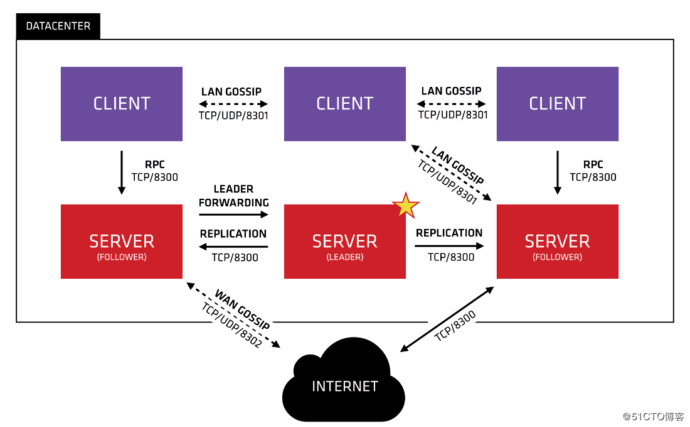

# Consul服务注册中心

## 一、简介

Consul 用于实现分布式系统的服务注册与配置，与其它方案相比，Consul 更 "一站式"，内置了服务注册与发现框架、分布一致性协议实现、健康检查、Key/Value 存储、多数据中心方案，不需要依赖其他工具，使用起来也很方便。

Consul 使用 Go 语言，具有天然可移植性，仅包含一个可执行文件，易于部署，可与 Docker 等轻量级容器无缝配合

## 二、功能

- 基于 Raft 算法
- 服务发现
- 健康检查
- Key/Value 存储
- 多数据中心
- 支持 http 和 dns 协议接口
- 官方提供 web 管理页面

## 三、角色

Consul 内部分为：

- client: 客户端，无状态，将 HTTP 和 DNS 接口请求转发给局域网内的服务器集群
- server: 服务端，保存配置信息，高可用集群，每个数据中心的 server 数量推荐为 3 或 5个 （奇数，因为大于等于一半不可用，则集群不可用）



## 四、工作原理

### 1、服务注册及发现

当 Producer 启动时，会将自己的 IP/Host 等信息通过请求告知 Consul， Consul 接收到 Producer 的注册信息后，每10s（默认）会向 Producer 发送一个健康检查的请求，检验 Producer 是否健康

### 2、服务调用

当 Consumer 请求 Producer 时，会先从 Consul 中 拿到存储 Producer 服务的临时表 （temp table），从中任选一个 Producer 的 IP 和 Port，然后根据这个 IP 和 Port，发送请求；temp table 表只包含了健康检查的信息，并每10s（默认）更新


## 五、起步

### 1、下载

> 下载地址：https://www.consul.io/downloads

### 2、安装

- cd 到对应目录下，使用 cmd 使用 consul

```bash
# -dev 表示开发模式运行，-server 表示服务模式运行
consul agent -dev -client=0.0.0.0
```

- 为了方便启动，也可以在 consul.exe 同级目录下创建一个脚本来启动

```bash
consul agent -dev -client=0.0.0.0
pause
```

- 访问管理后台：http：localhost://8500

## 六、实例