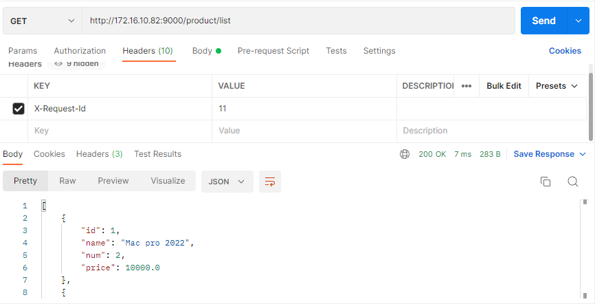

# Gateway 服务网关

## 一、简介

微服务中，客户端调用服务时，将服务分发到对应的微服务

### 优点：

- 客户端无需多次请求不同的微服务，降低了客户端的复杂性
- 解决跨域问题
- 解决身份认证问题
- 解决了项目迭代问题
- 解决了一些协议的问题

### 特性：

- 统一接入： 

  > 为各种无线应用提供统一接入入口
  >
  > 高性能、高并发、高可靠
  >
  > 负载均衡、容灾切换（异地多活）

- 流量监管

  > 服务降级
  >
  > 熔断
  >
  > 路由（异地多活中的应用）

- 安全防护

  > 和安全部合作，IP 黑名单，URL 黑名单
  >
  > 风控防刷，恶意攻击等

- 协议适配

  > 前端系统（http、https）后端（RPC）
  >
  > 长连接、短链接支持
  >
  > 根据请求路由分配至相应的 SOA 服务并执行

### 总结：

- 性能：API 高可用、负载均衡、容错机制
- 安全：权限身份认证，流量清洗，黑名单，后端签名等
- 日志：日志记录，一旦涉及分布式，全链路跟踪必不可少
- 缓存：数据缓存
- 监控：记录请求响应数据，API 耗时分析，性能监控
- 限流：流量控制，错峰流控，可定义多种限流规则
- 灰度：线上灰度部署，减小风险
- 路由：动态路由

## 二、核心概念

- 路由：是网关最基础的部分，由ID、目标URI、一组断言和一组过滤器组成，断言为真说明请求的 URI 和配置匹配
- 断言：Java 8 中的断言函数，允许自定义匹配来自于 Http Request 中的任何信息
- 过滤器：标准的 Spring Web Filter 对请求和响应进行处理

## 三、路由规则

### 1、Path

```yml
spring:
  cloud:
    # 路由规则
    gateway:
      routes:
        # 将 http://localhost:9000/product/** 路由至 http://localhost:7070/product/**
        - id: provider                  # 路由 ID，唯一
          uri: http://localhost:7070/   # 目标 URI，路由到微服务的地址
          predicates:                   # 断言（判断条件）
            - Path=/product/**          # 匹配对应的 URL 请求
```

### 2、Query

```yml
spring:
  cloud:
    # 路由规则
    gateway:
        # 将 http://localhost:9000/product/** 路由至 http://localhost:7070/product/**
        - id: order                     # 路由 ID，唯一
          uri: http://localhost:6060/   # 目标 URI，路由到微服务的地址
          predicates:                   # 断言（判断条件）
            - Query=name                # 匹配请求参数中包含 name 的请求
#            - Query=name, abc.          # 匹配请求参数中包含 name 且满足正则表达式 abc. 的请求
```

- **Query=name：** 比如：http://localhost:9000/product/?name=123
- **Query=name，abc.：** 比如：http://localhost:9000/product/?name=abc123

### 3、Method

```yml
spring:
  cloud:
    # 路由规则
    gateway:
      routes:
        # Method
        - id: provider                                            # 路由 ID，唯一
          uri: http://localhost:7070/                             # 目标 URI，路由到微服务的地址
          predicates:                                             # 断言（判断条件）
            - Method=GET                                          # 匹配 GET 请求
```

### 4、Datetime

```yml
spring:
  cloud:
    # 路由规则
    gateway:
      routes:
        # Datetime
        - id: provider                  # 路由 ID，唯一
          uri: http://localhost:7070/   # 目标 URI，路由到微服务的地址
          predicates:                   # 断言（判断条件）
          # 匹配中国上海 2022-06-27 16:00:00 后的时间
            - After=2022-06-27T16:00:00.000+08:00[Asia/Shanghai]
```

### 5、RomoteAddr

```yml
spring:
  cloud:
    # 路由规则
    gateway:
      routes:
        - id: provider                                            # 路由 ID，唯一
          uri: http://localhost:7070/                             # 目标 URI，路由到微服务的地址
          predicates:                                             # 断言（判断条件）
            # RemoteAddr
            - RemoteAddr=172.16.10.82/0                            # 匹配请求中地址是 172.16.10.82 的请求，/0为子网掩码
```

> API： http://172.16.10.82:9000/product/list

### 6、Header

```yml
spring:
  cloud:
    # 路由规则
    gateway:
      routes:
        - id: provider                                            # 路由 ID，唯一
          uri: http://localhost:7070/                             # 目标 URI，路由到微服务的地址
          predicates:                                             # 断言（判断条件）
            # Header
            - Header=X-Request-Id, \d+                            # 匹配请求头中包含 X-Request-Id 并且其值匹配正则表达式 \d+ 的请求
```



## 四、动态路由

### 1、依赖

```xml
<dependency>
    <groupId>org.springframework.cloud</groupId>
    <artifactId>spring-cloud-starter-netflix-eureka-client</artifactId>
</dependency>
```

### 2、配置

#### 动态获取URI

```yml
spring:
  cloud:
    # 路由规则
    gateway:
      routes:
        - id: provider                                            # 路由 ID，唯一
          uri: lb://provider                                      # 根据注册中心动态路由
#          uri: http://localhost:7070/                            # 目标 URI，路由到微服务的地址
          predicates:                                             # 断言（判断条件）
            # Path
            - Path=/product/**                                    # 匹配对应的 URL 请求
```

> API：http://localhost:9000/product/list

#### 服务名称转发

```yml
spring:
  cloud:
    # 路由规则
    gateway:
      discovery:
        locator:
          # 是否与服务发现组件进行结合，通过 serviceId 转发到具体服务
          enabled: true                      # 是否开启基于服务发现的路由规则
          lower-case-service-id: true        # 是否将服务名称转小写
```

> API前要加服务名称服务名称： http://localhost:9000/**provider**/product/list

## 五、过滤器

### 1、网关过滤器 GatewayFilter

通过 spring.cloud.routes.filters 配置在具体路由下，只作用于当前路由或通过 spring.cloud.default-filters 配置在全局，作用在所有路由上

#### 局部

#####  Path 过滤器

```yml
spring:
  cloud:
    # 路由规则
    gateway:
      routes:
        - id: provider                                            # 路由 ID，唯一
          uri: lb://provider                                      # 根据注册中心动态路由
#          uri: http://localhost:7070/                            # 目标 URI，路由到微服务的地址
          predicates:                                             # 断言（判断条件）
            # Path
            - Path=/product/**,/gateway/**                        # 匹配对应的 URL 请求
          filters:
            # 将 /gateway/product/list 重写为 /product/list
            - RewritePath=/gateway(?<segment>/?.*),$\{segment}
            # 请求增加前缀 /list 变为 /product/list 
            - PrefixPath=/product
            # 分割前缀 /api/gateway/product/list 变为 /product/list 
            - StripPrefix=2
            
        - id: provider2                                           # 路由 ID，唯一
          uri: lb://provider                                      # 根据注册中心动态路由
          predicates:                                             # 断言（判断条件）
            # Path          设置参数 segment 
            - Path=/gateway/product/{segment}  
          filters:
            # 将 /gateway/product/list 重写为 /product/list
            - SetPath=/product/{segment}
```

##### Parameter 参数过滤器

```yml
spring:
  cloud:
    # 路由规则
    gateway:
      routes:
        - id: provider                                            # 路由 ID，唯一
          uri: lb://provider                                      # 根据注册中心动态路由
          predicates:                                             # 断言（判断条件）
            # Path
            - Path=/**                                            # 匹配对应的 URL 请求
          filters:
            # 在下游请求中添加 id = 1
            - AddRequestParameter=id,1
```

##### Status 状态过滤器 

```yml
spring:
  cloud:
    # 路由规则
    gateway:
      routes:
        - id: provider                                            # 路由 ID，唯一
          uri: lb://provider                                      # 根据注册中心动态路由
          predicates:                                             # 断言（判断条件）
            # Path
            - Path=/product/**,/gateway/**                        # 匹配对应的 URL 请求
          filters:
            # 在任何情况下，响应状态码设置为888
            - SetStatus=888
```

#### 全局

设置全局默认 filters

```yml
spring:
  application:
    name: gateway # 应用名称
  cloud:
      # 路由规则
    gateway:
      discovery:
        locator:
          # 是否与服务发现组件进行结合，通过 serviceId 转发到具体服务
          enabled: true                      # 是否开启基于服务发现的路由规则
          lower-case-service-id: true        # 是否将服务名称转小写
      default-filters:
        - PrefixPath=/product
```

### 2、全局过滤器 GlobalFilter

无需在配置文件中配置，作用在所有的路由上，最终通过 GatewayFilterAdapter 包装成 GatewayFilterChain 可识别的过滤器，它为请求业务以及路由的 URI 转换为真实业务请求地址的核心过滤器，不需要配置系统初始化时加载，并作用在每个路由上

### 3、自定义过滤器

##### 自定义网关过滤器

CustomGatewayFilter：实现接口： GatewayFilter，Ordered

```java
import org.springframework.cloud.gateway.filter.GatewayFilter;
import org.springframework.cloud.gateway.filter.GatewayFilterChain;
import org.springframework.core.Ordered;
import org.springframework.web.server.ServerWebExchange;
import reactor.core.publisher.Mono;

/**
 * Date: 2022-06-28 星期二
 * Time: 13:56
 * Author: Dily_Su
 * Remark: 自定义网关协议
 */
public class CustomGatewayFilter implements GatewayFilter, Ordered {

    /**
     * 过滤器业务逻辑
     *
     * @param exchange
     * @param chain
     * @return
     */
    @Override
    public Mono<Void> filter(ServerWebExchange exchange, GatewayFilterChain chain) {
        System.out.println("自定义网关过滤器被执行");
        return chain.filter(exchange);
    }

    /**
     * 过滤器执行顺序，数值越小，优先级越高
     *
     * @return
     */
    @Override
    public int getOrder() {
        return 0;
    }
}
```

Configuration

```java
import com.study.gateway.filter.CustomGatewayFilter;
import org.springframework.cloud.gateway.route.RouteLocator;
import org.springframework.cloud.gateway.route.builder.RouteLocatorBuilder;
import org.springframework.context.annotation.Bean;
import org.springframework.context.annotation.Configuration;

/**
 * Date: 2022-06-28 星期二
 * Time: 14:00
 * Author: Dily_Su
 * Remark:
 */
@Configuration
public class GatewayRoutesConfiguration {
    @Bean
    public RouteLocator routeLocator(RouteLocatorBuilder builder) {
        return builder.routes().route("test1", r -> r
                        // 断言（判断条件）
                        .path("/product/**")
                        // 自定义网关过滤器
                        .filters(f -> f.filter(new CustomGatewayFilter()))
                        // 目标 URI 路由到服务器的地址
                        .uri("lb://provider"))
                .build();
    }
}
```

##### 自定义全局过滤器

CustomGlobalFilter：实现接口： GatewayFilter，Ordered

```java
import org.springframework.cloud.gateway.filter.GatewayFilterChain;
import org.springframework.cloud.gateway.filter.GlobalFilter;
import org.springframework.core.Ordered;
import org.springframework.core.io.buffer.DataBuffer;
import org.springframework.http.HttpStatus;
import org.springframework.http.MediaType;
import org.springframework.http.server.reactive.ServerHttpResponse;
import org.springframework.stereotype.Component;
import org.springframework.web.server.ServerWebExchange;
import reactor.core.publisher.Mono;
import java.nio.charset.StandardCharsets;

/**
 * Date: 2022-06-28 星期二
 * Time: 14:55
 * Author: Dily_Su
 * Remark: 自定义全局过滤器
 * 统一鉴权
 */
@Component
public class CustomGlobalFilter implements GlobalFilter, Ordered {

    /**
     * 过滤器业务逻辑
     *
     * @param exchange
     * @param chain
     * @return
     */
    @Override
    public Mono<Void> filter(ServerWebExchange exchange, GatewayFilterChain chain) {
        System.out.println("自定义全局过滤器被执行");

        // 获取请求参数 
        String token = exchange.getRequest().getQueryParams().getFirst("token");
        // 业务处理
        if (token == null){
            ServerHttpResponse response = exchange.getResponse();
            // 响应类型
            response.getHeaders().add("Content-Type", MediaType.APPLICATION_JSON_VALUE);
            // 响应状态， 401 代表没权限
            response.setStatusCode(HttpStatus.UNAUTHORIZED);
            // 响应内容
            String message = "{\"message\":" + HttpStatus.UNAUTHORIZED.getReasonPhrase() + "\"}";
            DataBuffer buffer = response.bufferFactory().wrap(message.getBytes(StandardCharsets.UTF_8));
            // 请求结束
            return response.writeWith(Mono.just(buffer));
        }
        // 使用 token 进行身份验证
        System.out.println("验证通过");
        return chain.filter(exchange);
    }

    @Override
    public int getOrder() {
        return 0;
    }
}

```


## 六、网关限流

顾名思义，限制流量，通过限流控制系统的QPS，从而保护系统

### 1、原因

- 用户增长过快
- 热点事件（如微博热搜）
- 竞争对手爬虫
- 恶意请求

### 2、限流算法

#### 计算器算法

设置规定时间内请求数量

> 时间节点前后一起发送请求上限的请求，数量可能会超出，拖垮服务
>
> 资源浪费

#### 漏桶算法（Leaky）

使用队列机制，请求进入网关不做限制，但是从网关访问下行服务时按规定速率请求

> 请求堆积，网关压力大，网关容易宕机
>
> 超出队列上限，可能导致请求丢失
>
> 微服务资源浪费

#### 令牌桶算法（Token）

改进的漏桶算法，可以应对突发请求

> 1、网关恒定速率生成令牌放入令牌桶，桶满后丢弃令牌
>
> 2、请求到达后先获取令牌再做业务处理，没拿到令牌的请求丢弃


### 3、实例

通过 RequestRateLimiterGatewayFilterFactory 过滤工厂，使用Redis 和 lua 实现令牌桶

#### URI 限流

KeyResolverConfiguration

```java
import org.springframework.cloud.gateway.filter.ratelimit.KeyResolver;
import org.springframework.context.annotation.Bean;
import org.springframework.context.annotation.Configuration;
import reactor.core.publisher.Mono;

/**
 * Date: 2022-06-28 星期二
 * Time: 16:45
 * Author: Dily_Su
 * Remark:
 */
@Configuration
public class KeyResolverConfiguration {
    /**
     * 限流规则
     * URI 限流
     * @return
     */
    @Bean
    public KeyResolver pathKeyResolver() {
        return exchange -> Mono.just(exchange.getRequest().getURI().getPath());
    }
}
```

application.yml

```yml
spring:
  application:
    name: gateway # 应用名称
  cloud:
      # 路由规则
    gateway:
      routes:
        - id: provider                                            # 路由 ID，唯一
          uri: lb://provider                                      # 根据注册中心动态路由
          predicates:                                             # 断言（判断条件）
            - Path=/product/**                                           # 匹配对应的 URL 请求,并追加到 URI 后
          filters:
            - name: RequestRateLimiter
              args:
                redis-rate-limiter.replenishRate: 1  # 令牌每秒填充数量
                redis-rate-limiter.burstCapacity: 2  # 令牌桶总容量
                key-resolver: "#{@pathKeyResolver}"  # 使用 SpEL 表达式按名称引用 bean

  redis:
    host: localhost               # redis 地址
    port: 6379                    # 端口
    database: 1                   # database
```

> redis 中的 令牌会自动清理

#### 参数限流

KeyResolverConfiguration

```java
import org.springframework.cloud.gateway.filter.ratelimit.KeyResolver;
import org.springframework.context.annotation.Bean;
import org.springframework.context.annotation.Configuration;
import reactor.core.publisher.Mono;

/**
 * Date: 2022-06-28 星期二
 * Time: 16:45
 * Author: Dily_Su
 * Remark: 限流规则
 * 下面 Bean 只能有一个
 */
@Configuration
public class KeyResolverConfiguration {
    /**
     * 参数 限流
     *
     * @return
     */
    @Bean
    public KeyResolver parameterKeyResolver() {
        return exchange -> Mono.just(Objects.requireNonNull(exchange.getRequest().getQueryParams().getFirst("id")));
    }
}
```

application.yml

```yml
spring:
  application:
    name: gateway # 应用名称
  cloud:
      # 路由规则
    gateway:
      routes:
        - id: provider                                            # 路由 ID，唯一
          uri: lb://provider                                      # 根据注册中心动态路由
          predicates:                                             # 断言（判断条件）
            - Path=/product/**                                           # 匹配对应的 URL 请求,并追加到 URI 后
          filters:
            - name: RequestRateLimiter
              args:
                redis-rate-limiter.replenishRate: 1       # 令牌每秒填充数量
                redis-rate-limiter.burstCapacity: 2       # 令牌桶总容量
                key-resolver: "#{@parameterKeyResolver}"  # 使用 SpEL 表达式按名称引用 bean

  redis:
    host: localhost
    port: 6379
    database: 1
```

#### IP 限流

KeyResolverConfiguration

```java
import org.springframework.cloud.gateway.filter.ratelimit.KeyResolver;
import org.springframework.context.annotation.Bean;
import org.springframework.context.annotation.Configuration;
import reactor.core.publisher.Mono;

/**
 * Date: 2022-06-28 星期二
 * Time: 16:45
 * Author: Dily_Su
 * Remark: 限流规则
 * 下面 Bean 只能有一个
 */
@Configuration
public class KeyResolverConfiguration {
    /**
     * IP 限流
     *
     * @return
     */
    @Bean
    public KeyResolver ipKeyResolver() {
        return exchange -> Mono.just(Objects.requireNonNull(exchange.getRequest().getRemoteAddress().getHostName()));
    }
}
```

application.yml

```yml
spring:
  application:
    name: gateway # 应用名称
  cloud:
      # 路由规则
    gateway:
      routes:
        - id: provider                                            # 路由 ID，唯一
          uri: lb://provider                                      # 根据注册中心动态路由
          predicates:                                             # 断言（判断条件）
            - Path=/product/**                                           # 匹配对应的 URL 请求,并追加到 URI 后
          filters:
            - name: RequestRateLimiter
              args:
                redis-rate-limiter.replenishRate: 1  # 令牌每秒填充数量
                redis-rate-limiter.burstCapacity: 2  # 令牌桶总容量
                key-resolver: "#{@ipKeyResolver}"    # 使用 SpEL 表达式按名称引用 bean

  redis:
    host: localhost
    port: 6379
    database: 1
```


## 七、高可用网关

nginx + 网关集群 + docker部署


### 1、项目结构


### 2、配置文件

#### **parent 中的 pom.xml** 

```xml
<?xml version="1.0" encoding="UTF-8"?>
<project xmlns="http://maven.apache.org/POM/4.0.0" xmlns:xsi="http://www.w3.org/2001/XMLSchema-instance"
         xsi:schemaLocation="http://maven.apache.org/POM/4.0.0 https://maven.apache.org/xsd/maven-4.0.0.xsd">
    <modelVersion>4.0.0</modelVersion>
    <parent>
        <groupId>org.springframework.boot</groupId>
        <artifactId>spring-boot-starter-parent</artifactId>
        <version>2.6.8</version>
        <relativePath/> <!-- lookup parent from repository -->
    </parent>
    <groupId>com.study</groupId>
    <artifactId>parent</artifactId>
    <version>0.0.1-SNAPSHOT</version>
    <packaging>pom</packaging>

    <!-- 版本控制 -->
    <properties>
        <java.version>11</java.version>
        <project.build.sourceEncoding>UTF-8</project.build.sourceEncoding>
        <project.reporting.outputEncoding>UTF-8</project.reporting.outputEncoding>
        <spring-cloud.version>2021.0.3</spring-cloud.version>
        <packaging.type>jar</packaging.type>
        <lombok.version>1.18.24</lombok.version>
        <feign-httpClienr.version>10.7.4</feign-httpClienr.version>
        <ribbon.version>2.7.18</ribbon.version>
    </properties>

    <!-- maven 仓库 -->
    <repositories>
        <repository>
            <id>central</id>
            <name>Nexus aliyun</name>
            <url>https://maven.aliyun.com/repository/public</url>
        </repository>
    </repositories>
    
    <!-- 依赖版本控制 -->
    <dependencyManagement>
        <dependencies>
            <dependency>
                <groupId>org.projectlombok</groupId>
                <artifactId>lombok</artifactId>
                <version>${lombok.version}</version>
                <optional>true</optional>
            </dependency>

            <dependency>
                <groupId>org.springframework.cloud</groupId>
                <artifactId>spring-cloud-dependencies</artifactId>
                <version>${spring-cloud.version}</version>
                <type>pom</type>
                <scope>import</scope>
            </dependency>
            <!--        Feign 使用 httpClient -->
            <dependency>
                <groupId>io.github.openfeign</groupId>
                <artifactId>feign-httpclient</artifactId>
                <version>${feign-httpClienr.version}</version>
            </dependency>
            <!--        ribbon 点对点直连 和 局部负载均衡 不可用-->
            <dependency>
                <groupId>com.netflix.ribbon</groupId>
                <artifactId>ribbon-loadbalancer</artifactId>
                <version>${ribbon.version}</version>
            </dependency>
        </dependencies>
    </dependencyManagement>

    <build>
        <plugins>
            <plugin>
                <groupId>org.springframework.boot</groupId>
                <artifactId>spring-boot-maven-plugin</artifactId>
                <configuration>
                    <excludes>
                        <exclude>
                            <groupId>org.projectlombok</groupId>
                            <artifactId>lombok</artifactId>
                        </exclude>
                    </excludes>
                </configuration>
            </plugin>
        </plugins>
    </build>

    <!-- 项目打包配置 -->
    <!-- 不同的打包方式，使用不同的配置文件 -->
    <profiles>
        <profile>
            <id>docker</id>
            <properties>
                <activated.profile>docker</activated.profile>
                <!-- redis连接，更改 application-docker.yml 中的值 -->
                <redis.host>cloud-redis</redis.host>
                <redis.port>6379</redis.port>
            </properties>
            <build>
                <resources>
                    <resource>
                        <filtering>true</filtering>
                        <directory>src/main/resources</directory>
                    </resource>
                </resources>
            </build>
        </profile>
        <profile>
            <id>dev</id>
            <properties>
                <activated.profile>dev</activated.profile>
                <!-- redis连接，更改 application.yml 中的值 -->
                <redis.host>localhost</redis.host>
                <redis.port>6379</redis.port>
            </properties>
            <build>
                <resources>
                    <resource>
                        <filtering>true</filtering>
                        <directory>src/main/resources</directory>
                        <excludes>
                            <exclude>application-docker.*</exclude>
                        </excludes>
                    </resource>
                </resources>
            </build>
        </profile>
    </profiles>
</project>
```

#### **nginx.conf**

```nginx
# nginx 配置文件：负载均衡默认为轮询
worker_processes 1;

events { worker_connections 1024; }

http {
    include    /etc/nginx/mime.types;
    sendfile   on;

    proxy_buffer_size   128k;
    proxy_buffers   4 256k;
    proxy_busy_buffers_size   256k;

    client_max_body_size   100m;

    # 网关集群
    upstream gateway {
        # docker 中 localhost 为 镜像容器名
        server gateway-01:9000;
        server gateway-02:9001;
    }

    server {
        listen 8080;

        location / {
            # 将所有请求指向 网关集群
            proxy_pass http://gateway;
        }
    }
}
```

#### **dockerFile**

```apl
# 每个微服务根目录下都要放置一个,用于将打包好的 jar 整理为 docker image
# jdk 版本不能低于自己编译时的版本，否则 docker 启动会报错
FROM openjdk:11.0.15-jre
ARG JAR_FILE=target/*.jar
COPY ${JAR_FILE} app.jar
WORKDIR /
ENTRYPOINT ["java","-jar","/app.jar"]
```

#### **docker-compose.yml**

```yml
version: "3.7"
services:
  redis:
    image: redis:latest  # 从 docker hub 中 pull 最新的 redis image
    container_name: cloud-redis # docker 中的容器名称
    ports:               # 对外映射的端口，占用容器内的 6379，本机的26379，不想对外暴漏时，可以省略
      - "26379:6379"
    networks:            # 容器内网关，用于容器内镜像互相调用
      - backend
    environment:         # 设置时区
      - TZ=Asia/Shanghai

  erurka-01:
    build: ./eureka01    # build 存在时，表示从该目录下获取镜像名称
    image: cloud/eureka01:latest # 镜像名称
    container_name: eureka-01 # 容器名称
    ports:
      - "28761:8761"
    networks:
      - backend
    environment:
      - TZ=Asia/Shanghai

  erurka-02:
    build: ./eureka02
    image: cloud/eureka02:latest
    container_name: eureka-02
    ports:
      - "28762:8762"
    networks:
      - backend
    environment:
      - TZ=Asia/Shanghai

  gateway-01:
    build: ./gateway01
    image: cloud/gateway01:latest
    container_name: gateway-01
    networks:
      - backend
    environment:
      - TZ=Asia/Shanghai

  gateway-02:
    build: ./gateway02
    image: cloud/gateway02:latest
    container_name: gateway-02
    networks:
      - backend
    environment:
      - TZ=Asia/Shanghai

  provider-01:
    build: ./provider01
    image: cloud/provider01:latest
    container_name: provider-01
    networks:
      - backend
    environment:
      - TZ=Asia/Shanghai

  provider-02:
    build: ./provider02
    image: cloud/provider02:latest
    container_name: provider-02
    networks:
      - backend
    environment:
      - TZ=Asia/Shanghai

  consumer-eureka:
    build: ./consumer-eureka
    image: cloud/consumer-eureka:latest
    container_name: consumer-eureka
    networks:
      - backend
    environment:
      - TZ=Asia/Shanghai

  consumer-eureka-feign:
    build: ./consumer-eureka-feign
    image: cloud/consumer-eureka-feign:latest
    container_name: consumer-eureka-feign
    networks:
      - backend
    environment:
      - TZ=Asia/Shanghai

  nginx:
    image: nginx
    container_name: cloud-demo-nginx
    volumes:
      - ./nginx.conf:/etc/nginx/nginx.conf
    ports:
      - 28080:8080
    restart: unless-stopped
    networks:
      - backend

networks: # 该微服务项目在容器中的网关
  backend: 
    name: cloud-demo 
```

### 3、docker 部署

#### **Maven 打包**

```bash
# 清理 targer 文件，并按照 按照 docker 配置 打包
 mvn clean package -P docker -DskipTests
```

#### **docker部署**

```bash
# build image 并 生成容器，启动 image
docker compose up -d 		
```

