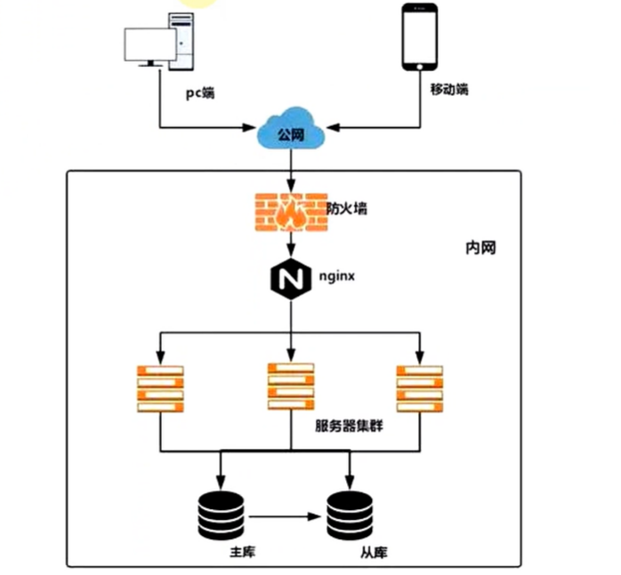
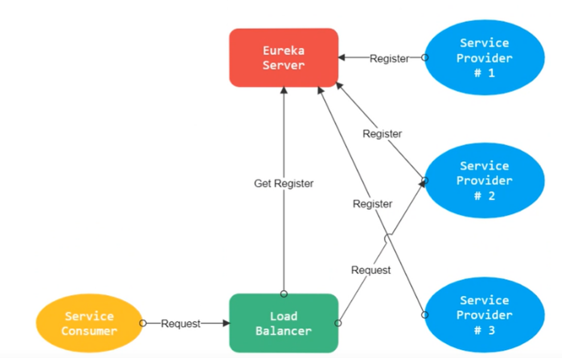

# Ribbon负载均衡

## 一、简介

Ribbon 是一个基于 HTTP 和 TCP 的客户端负载均衡工具，他是基于 Netftix Ribbon 实现的。其不是独立部署，但是几乎存在于每个 Spring Cloud 微服务中，包括 Feign 提供的声明式服务调用也是基于 Ribbon 实现的。

## 二、负载均衡不同方案的区别

### 1、集中式负载均衡（服务器负载均衡）

在 consumer 和 provider 之间使用独立的负载均衡设施（可以是硬件，如 F5，也可以是软件，如nginx），由该设施负责把请求通过某种策略发送至 provider

### 2、进程内负载均衡（客户端负载均衡）

将负载均衡逻辑集成到 consumer ，consumer 从注册中心获取可用地址，然后选择合适的 provider。 Ribbon 属于后者，他是一个类库，集成于 consumer ，consumer 通过其获取 provider 地址

## 三、负载均衡策略

### 1、轮询策略（默认）

策略对应类：RoundRubinRule

实现原理：轮询策略表示每次都顺序取下一个 provider 

### 2、权重轮询策略

策略对应类：WeightedResponseTimeRule

实现原理：

- 根据每个 provider 的响应时间分配权重，响应时间越长，权重越小，被选中的可能性越低
- 原理：一开始为轮询，并开启一个计时器，每 30s 收集一次每个 provider 的平均响应时间，当信息足够时，给每个 provider 附上一个权重，并按权重随机选择 provider，高权重的 provider 会被高概率选中 

### 3、随机策略

策略对应类：RandomRule

实现原理：从 provider 列表中随机选择一个

### 4、最少并发数策略

策略对应类：BestAvailableRule

实现原理：选择正在请求的并发数量最小的 provider ，除非这个 provider 熔断中

### 5、重试策略

策略对应类：RetryRule

实现原理：轮询策略增强版，轮询策略服务不可用时不做处理，重试策略服务不可用时会重新尝试集群中的其他节点

### 6、可用性敏感策略

策略对应类：AvailabilityFilteringRule

实现原理：过滤性能差的 provider

- 第一种：过滤掉在 Eureka 中处于一直连接失败的 provider
- 第二种：过滤掉高并发的 provider

### 7、区域敏感性策略

策略对应类：ZoneAvoidanceRule

实现原理：过滤性能差的 provider

- 以一个区域为单位考察可用性，对于不可用的区域整个丢弃，从剩下的区域中选取可用 provider
- 如果这个 ip 区域内有一个或多个实例不可达或响应变慢，都会降低该 ip 区域内其他 ip 被选中的权重
