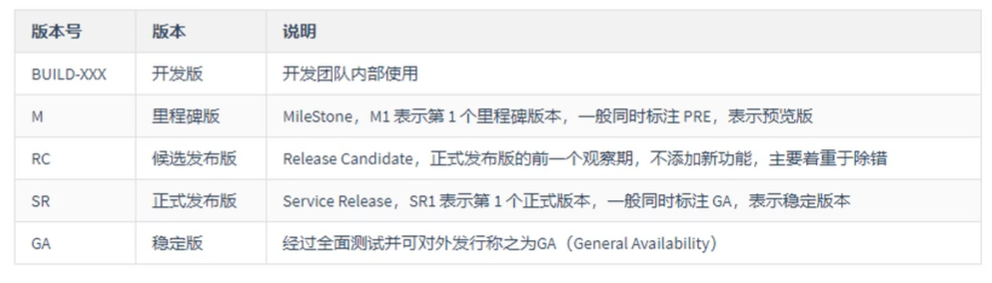

# SpringCloud 简介

## 一、概念定义

​          Sping Cloud 是一个服务治理平台，提供了一线服务框架，包含了：服务注册与发现、配置中心、消息中心、负载均衡、数据监控等

##  二、常用组件

- Spring Cloud Eureka
- Spring Cloud Task
- Spring Cloud Common
- Spring Cloud GateWay
- Spring Cloud Feign
- .......

## 三、版本信息

> Spring Cloud 版本使用伦敦地铁站名称命名，按首字母顺序排列，越靠后版本越高

