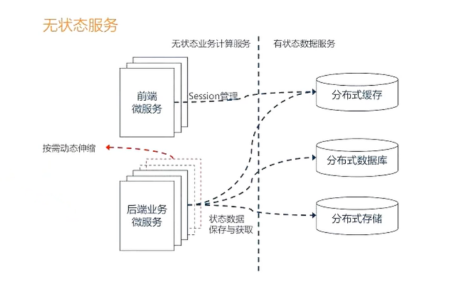

# 微服务架构介绍

## 一、技术架构演变

####   1.1    单体应用

​        model1模式: jsp + java

​        model2模式: MVC 模式

####   1.2  垂直应用

####   1.3 RPC 分布应用

####   1.4 SOA 流动计算架构

​          资源调度、负载均衡、动态服务创建.....服务治理

####   1.5 微服务

​        微小、单一职责

## 二、微服务简介

​        微服务就是将一个单体架构的应用按业务划分为一个个独立运行的程序即服务，他们之间通过HTTP协议进行通信（也可通过消息队列，如kafaka、RabbitMq等），可以采用不同的编程语言，使用不同的存储技术，自动化部署，减少人为控制，降低出错概率。服务数量较多，管理越来越复杂，因此采用集中化管理，如Eureka、Zookeeper 等比较常见的服务集中管理框架。

​      微服务是一种架构风格，一种大型的复杂软件应用，由一个或多个微服务组成，系统的各种微服务可被单独部署，各个微服务之间松耦合，每个微服务仅关注于完成一件任务并很好的完成该任务。

####   2.1  优点 

- 测试容易
- 可伸缩性强
- 可靠性强
- 跨语言
- 协同开发
- 方便系统迭代

#### 2.2 缺点

- 运维成本高，部署项目多
- 接口兼容版本问题
- 分布式系统复杂性
- 分布式事务

## 三、SOA vs 微服务

> 微服务是 SOA 发展出来的产物，是一种比较现代化的细粒度的 SOA 实现方式

| SOA（面向服务）                        | 微服务                                       |
| -------------------------------------- | -------------------------------------------- |
| 应用程序服务的可重用性最大化           | 专注于解耦                                   |
| 系统性的改变需要整体修改               | 系统性的改变是创建新服务                     |
| DevOps和持续交付正在变得流行，不是主流 | 强烈官族DevOps和持续交付                     |
| 专注一业务功能重用                     | 更重视 上下文 边界 的概念                    |
| 通信使用企业服务总线 ESB               | 对于通信，使用较少和简单的消息系统           |
| 支持多种消息协议                       | 使用轻量级协议，如HTTP、REST等               |
| 对部署到它的所有服务使用通用平台       | 应用程序服务器不是真的被使用，通常使用云平台 |
| 容器（docker）的使用不太受欢迎         | 容器在微服务方面效果很好                     |
| SOA 服务共享数据存储                   | 每个微服务可以拥有单独的数据存储             |
| 共同的治理和标准                       | 轻松的治理，更注重团队协作和选择自由         |

## 四、Dubbo vs Spring Cloud

- Spring 全家桶

  用起来很舒服，无所不能

- Dubbo

  很多国内企业还在用，支持RESTful 风格的 API，调用 API 像调用本地 API 一样，同时其基于接口的方式增加了服务间的耦合

| 对比项       | Spring Cloud                | Dubbo            |
| ------------ | --------------------------- | ---------------- |
| 带宽         | Spring Cloud Netflix Eureka | ZooKeeper，Nacos |
| 服务调用方式 | REST API                    | RPC              |
| 服务网关     | Sping Cloud Netflix Zuul    | Dubbo Proxy      |
| 断路由       | Sping Cloud Netflix Hystrix | Sentinet         |
| 分布式配置   | Sping Cloud Netflix Config  | Nacos            |
| 服务跟踪     | Sping Cloud Netflix Sleuth  | 无               |
| 消息总线     | Sping Cloud Netflix Bus     | 无               |
| 数据流       | Sping Cloud Netflix Stream  | 无               |
| 批量任务     | Sping Cloud Netflix Task    | 无               |

####      总结

-  Dubbo由于是二进制传输，占用带宽更少

- Spring Cloud 是http 协议传输，带宽比较多，同时使用 http，一般会使用Json报文，消耗会更大

- Dubbo 开发难度打，Dubbo 的 jar 包依赖问题很多大型工程无法解决

- Spring Cloud 的接口协议比较自由且松散，需要更强有力的行政做事来限制接口无序升级

- Dubbo 的注册中心可以选择ZooKeeper Redis 等多种，Spring Cloud 只能用 eureka 或者自研

- 系统结构简易程序：

  ​    Spring Cloud 系统结构更简单：注册 + Spring MVC = Spring Cloud

  ​    Dubbo： 各种复杂Url、protocol、register 等

- 性能：Dubbo 网络消耗小于 Spring Cloud ，但是国内大多数公司，网络消耗不是太大问题，如果成了问题，可以通过压缩、二进制、高速缓存、分段降级等方法，很容易解决

## 五、微服务设计原则

#### 5.1 AKF 拆分原则

- X轴：指的是水平复制，就是单体系统多运行几个实例，成为集群加负载均衡的模式
- Z轴：是基于类似的数据分区，例如互联网打车App 用户激增，集群扛不住，按照用户区域进行数据分区，北京、上海、广州等多建几个集群
- Y轴：微服务的拆分模式，基于不同的业务进行拆分

#### 5.2 前后端分离原则

- 前后端技术分离，可以由各自专家对各自领域进行优化，提升前端用户体验
- 前后端分离模式下，前后端交互页面更清晰，就剩下了接口模型，后端的接口更简洁明了，更容易维护
- 前端多渠道集成场景更容易，后端服务无需变更，采用统一的数据和模型，可支持多个前端，例如：微信H5前端、PC前端、安卓前端、IOS前端

#### 5.3 无状态服务

#### 5.4 Restful 通信风格

- 无状态协议HTTP，具有先天优势，扩展能力很强
- JSON报文序列化，轻量简单，人与机器均可读，学习成本低，搜索引擎友好
- 语言无关，各大热门语言都提供成熟的Restful API 框架，比 RPC 框架生态更完善