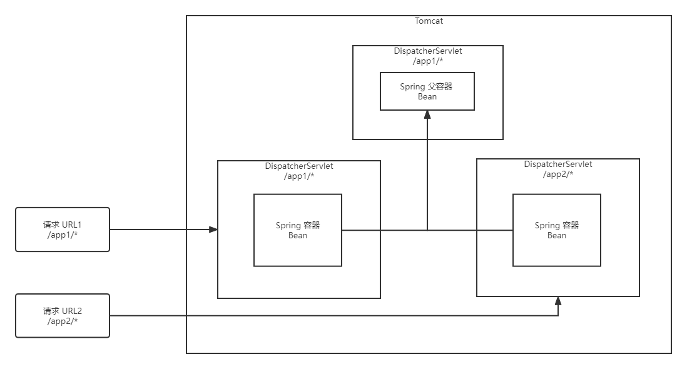
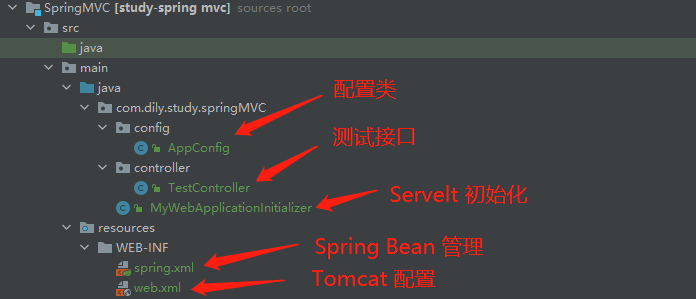
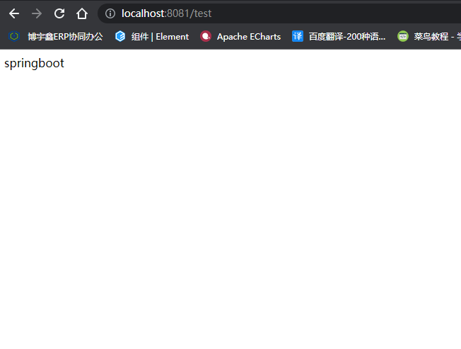

# Spring 源码

> 从 spring MVC 的工作原理，从而来推断 spring boot 的启动流程，手动创建 springboot 项目

## 一、Spring MVC 

### 1、项目启动流程

1、启动 Tomcat

2、解析 web.xml 

> web.xml 定义了要扫描的包
>
> ContextLoaderListener.contextInitialized()  ==> 创建Spring 父容器

3、实例化 DispatcherSerlet 对象

4、DispatcherSerlet 对象 init()   ==>   创建 spring 容器

### 2、请求访问流程



### 3、目录结构



### 4、代码

#### pom.xml 依赖

```xml
<?xml version="1.0" encoding="UTF-8"?>
<project xmlns="http://maven.apache.org/POM/4.0.0"
         xmlns:xsi="http://www.w3.org/2001/XMLSchema-instance"
         xsi:schemaLocation="http://maven.apache.org/POM/4.0.0 http://maven.apache.org/xsd/maven-4.0.0.xsd">
    <parent>
        <artifactId>ToolKit</artifactId>
        <groupId>com.dily</groupId>
        <version>0.0.1-SNAPSHOT</version>
    </parent>
    <modelVersion>4.0.0</modelVersion>

    <artifactId>SpringMVC</artifactId>
    <dependencies>
        <dependency>
            <groupId>javax.servlet</groupId>
            <artifactId>javax.servlet-api</artifactId>
            <version>4.0.1</version>
            <scope>compile</scope>
        </dependency>
        <dependency>
            <groupId>org.springframework</groupId>
            <artifactId>spring-webmvc</artifactId>
            <version>5.2.10.RELEASE</version>
            <scope>compile</scope>
        </dependency>
    </dependencies>

    <properties>
        <maven.compiler.source>11</maven.compiler.source>
        <maven.compiler.target>11</maven.compiler.target>
    </properties>

</project>
```

#### web.xml

```xml
<?xml version="1.0" encoding="UTF-8"?>
<web-app xmlns="https://jakarta.ee/xml/ns/jakartaee"
         xmlns:xsi="http://www.w3.org/2001/XMLSchema-instance"
         xsi:schemaLocation="https://jakarta.ee/xml/ns/jakartaee https://jakarta.ee/xml/ns/jakartaee/web-app_5_0.xsd"
         version="5.0">

    <!-- 定义 Tomcat 中的 Spring Servlet -->
    <servlet>
        <servlet-name>app</servlet-name>
        <servlet-class>org.springframework.web.servlet.DispatcherServlet</servlet-class>
        <init-param>
            <param-name>contextConfigLocation</param-name>
            <!-- 配置文件路径 -->
            <param-value>/src/main/resources/WEB-INF/spring.xml</param-value>
        </init-param>
        <load-on-startup>1</load-on-startup>
    </servlet>

    <!-- 定义 servlet 和 url 的映射关系 -->
    <servlet-mapping>
        <servlet-name>app</servlet-name>
        <url-pattern>/app/*</url-pattern>
    </servlet-mapping>
</web-app>
```

#### Spring.xml

```xml
<?xml version="1.0" encoding="UTF-8"?>
<beans xmlns="http://www.springframework.org/schema/beans"
       xmlns:xsi="http://www.w3.org/2001/XMLSchema-instance"
       xmlns:context="http://www.springframework.org/schema/context"
       xsi:schemaLocation="http://www.springframework.org/schema/beans http://www.springframework.org/schema/beans/spring-beans.xsd http://www.springframework.org/schema/context https://www.springframework.org/schema/context/spring-context.xsd">

 	<!-- 定义扫描路径 -->
    <context:component-scan base-package="com.dily.springMVC"/>
</beans>
```

#### Spring Servlet

```java
import com.dily.study.springMVC.config.AppConfig;
import org.springframework.web.WebApplicationInitializer;
import org.springframework.web.context.support.AnnotationConfigWebApplicationContext;
import org.springframework.web.servlet.DispatcherServlet;

import javax.servlet.ServletContext;
import javax.servlet.ServletRegistration;

/**
 * Date: 2022-07-01 星期五
 * Time: 15:56
 * Author: Dily_Su
 * Remark: Spring MVC 创建 Servlet
 */
public class MyWebApplicationInitializer implements WebApplicationInitializer {
    @Override
    public void onStartup(ServletContext servletContext) {
        // 加载 Spring web config
        AnnotationConfigWebApplicationContext context = new AnnotationConfigWebApplicationContext();
        context.register(AppConfig.class);

        // 设置父容器
        AnnotationConfigWebApplicationContext parent = new AnnotationConfigWebApplicationContext();
        parent.register(AppConfig.class);
        context.setParent(parent);

        // 新建一个 Servlet
        DispatcherServlet servlet = new DispatcherServlet(context);
        // 设置 Servlet 名称
        ServletRegistration.Dynamic registration = servletContext.addServlet("app",servlet);
        // 是否在启动时加载
        registration.setLoadOnStartup(1);
        // Servlet 对应的路径
        registration.addMapping("/app/*");
    }
}

```

#### AppConfig 配置

```java
import org.springframework.context.annotation.ComponentScan;

/**
 * Date: 2022-07-01 星期五
 * Time: 15:58
 * Author: Dily_Su
 * Remark: Spring MVC Servlet 容器配置扫描包
 */

@ComponentScan("com.dily.study.demo") // 扫描包
public class AppConfig {
}
```

### 4、配置Tomcat

idea 中配置 Tomcat，启动

## 二、Spring boot 

> 手动搭建 Spring Boot 项目，由此深入 Spring Boot 源码

### 1、项目结构


### 2、代码

#### pom.xml 依赖

```xml
<?xml version="1.0" encoding="UTF-8"?>
<project xmlns="http://maven.apache.org/POM/4.0.0" xmlns:xsi="http://www.w3.org/2001/XMLSchema-instance"
         xsi:schemaLocation="http://maven.apache.org/POM/4.0.0 https://maven.apache.org/xsd/maven-4.0.0.xsd">
    <modelVersion>4.0.0</modelVersion>
    <parent>
        <groupId>org.springframework.boot</groupId>
        <artifactId>spring-boot-starter-parent</artifactId>
        <version>2.7.1</version>
        <relativePath/> <!-- lookup parent from repository -->
    </parent>
    <groupId>com.dily.study</groupId>
    <artifactId>springboot</artifactId>
    <version>0.0.1-SNAPSHOT</version>
    <name>springboot</name>
    <description>springboot</description>
    <properties>
        <java.version>11</java.version>
    </properties>
    <dependencies>
        <dependency>
            <groupId>org.springframework.boot</groupId>
            <artifactId>spring-boot-starter-web</artifactId>
            <!--            不使用 tomcat 时-->
            <!--            <exclusions>-->
            <!--                <exclusion>-->
            <!--                    <groupId>org.springframework.boot</groupId>-->
            <!--                    <artifactId>spring-boot-starter-tomcat</artifactId>-->
            <!--                </exclusion>-->
            <!--            </exclusions>-->
        </dependency>
        <!--            使用 jetty 时-->
        <!--        <dependency>-->
        <!--            <groupId>org.springframework.boot</groupId>-->
        <!--            <artifactId>spring-boot-starter-jetty</artifactId>-->
        <!--        </dependency>-->
    </dependencies>

    <build>
        <plugins>
            <plugin>
                <groupId>org.springframework.boot</groupId>
                <artifactId>spring-boot-maven-plugin</artifactId>
            </plugin>
        </plugins>
    </build>

</project>
```

#### @DilySpringBootApplication 自定义注解类

```java
import org.springframework.boot.autoconfigure.SpringBootApplication;
import org.springframework.context.annotation.ComponentScan;
import org.springframework.context.annotation.Configuration;

import java.lang.annotation.*;

/**
 * Date: 2022-07-04 星期一
 * Time: 10:42
 * Author: Dily_Su
 * Remark: 自定义注解
 */
@Target(ElementType.TYPE)                 // 作用范围 类、接口、枚举
@Retention(RetentionPolicy.RUNTIME)       // 作用时间 运行时
@Documented                               // 该注解标记为公共 API, 可被文档化
@Inherited                                // 该注解是可被使用该注解的类继承
@Configuration                            // 声明为配置类
@ComponentScan                            // 扫描被注解对象所在目录
public @interface DilySpringBootApplication {
}
```

#### DefaultConfig 默认配置类

```java
import org.springframework.context.annotation.Bean;
import org.springframework.context.annotation.Configuration;
import org.springframework.web.servlet.DispatcherServlet;

/**
 * Date: 2022-07-04 星期一
 * Time: 11:09
 * Author: Dily_Su
 * Remark: 默认配置类
 */
@Configuration
public class DefaultConfig {

    /**
     * 配置默认的 Spring servlet 容器
     * @return DispatcherServlet
     */
    @Bean
    public DispatcherServlet dispatcherServlet() {
        return new DispatcherServlet();
    }
}
```

#### DilySpringApplication 静态加载类

```java
import org.apache.catalina.*;
import org.apache.catalina.connector.Connector;
import org.apache.catalina.core.StandardContext;
import org.apache.catalina.core.StandardEngine;
import org.apache.catalina.core.StandardHost;
import org.apache.catalina.startup.Tomcat;
import org.springframework.context.ConfigurableApplicationContext;
import org.springframework.web.context.support.AnnotationConfigWebApplicationContext;
import org.springframework.web.servlet.DispatcherServlet;

/**
 * Date: 2022-07-04 星期一
 * Time: 10:47
 * Author: Dily_Su
 * Remark: 静态加载类
 */
public class DilySpringApplication {

    public static ConfigurableApplicationContext run(Class config) {
        AnnotationConfigWebApplicationContext applicationContext = new AnnotationConfigWebApplicationContext();
        applicationContext.register(config);
        applicationContext.refresh();

        // spring boot 源码中 根据 pom.xml 中依赖 选择使用 tomcat / jetty / undertow, 默认使用 tomcat
        // 这里直接默认 tomcat
        startTomcat(applicationContext);

        return applicationContext;
    }

    /**
     * 创建 Tomcat 并启动
     * @param applicationContext spring 容器
     * @return Tomcat
     */
    private static Tomcat startTomcat(AnnotationConfigWebApplicationContext applicationContext) {
        // 创建和配置 Tomcat
        Tomcat tomcat = new Tomcat();

        Server server = tomcat.getServer();
        Service service = server.findService("Tomcat");

        Connector connector = new Connector();
        connector.setPort(8081);

        Engine engine = new StandardEngine();
        engine.setDefaultHost("localhost");

        Host host = new StandardHost();
        host.setName("localhost");

        String contextPath = "";
        Context context = new StandardContext();
        context.setPath(contextPath);
        context.addLifecycleListener(new Tomcat.FixContextListener());

        host.addChild(context);
        engine.addChild(host);

        service.setContainer(engine);
        service.addConnector(connector);

        // 从 IOC 容器中 获取 Spring Servlet
        DispatcherServlet defaultDispatcherServlet = applicationContext.getBean(DispatcherServlet.class);
        
        // 将获取到的 Spring servlet 加入到 tomcat 中
        tomcat.addServlet(contextPath, "dispatcher", defaultDispatcherServlet);
        context.addServletMappingDecoded("/*","dispatcher");

        try {
            // 启动 tomcat
            tomcat.start();
        }catch (LifecycleException e){
            e.printStackTrace();
        }

        return tomcat;
    }
}
```

#### TestApplication 启动类

```java
import com.dily.study.springboot.annotation.DilySpringBootApplication;

/**
 * Date: 2022-07-04 星期一
 * Time: 10:48
 * Author: Dily_Su
 * Remark: 启动类
 */
// 使用自定义注解
@DilySpringBootApplication
public class TestApplication {

    public static void main(String[] args) {
        // 调用静态资源加载类的 run()
        DilySpringApplication.run(TestApplication.class);
    }
}
```

TestController 测试接口

```java
package com.dily.study.springboot.controller;

import org.springframework.web.bind.annotation.RequestMapping;
import org.springframework.web.bind.annotation.RestController;

/**
 * Date: 2022-07-04 星期一
 * Time: 10:40
 * Author: Dily_Su
 * Remark: 测试接口
 */

@RestController
public class TestController {

    @RequestMapping("/test")
    public String test() {
        return "springboot";
    }
}
```

### 3、测试结果

