# Spring 事务

## 一、简介

> 概念：事务是数据库操作的最小工作单元，是作为单个逻辑工作单元执行的一系列操作，这些操作一起提交，要么都执行，要么都不执行。事务时一组不可分割的操作集合（工作逻辑单元）。

简而言之，就是一系列操作要么都执行成功（事务提交），要么都执行失败（事务回滚）

## 二、特性（一原持久隔离）

### 3.1 原子性

事务中所有操作是不可再分割的原子单位。事务中所有操作要么都执行成功，要么都执行失败

### 3.2 一致性（类似能量守恒）

事务执行后，数据库状态与其他业务规则保持一致，保证数据的一致性

### 3.3 隔离性

在并发操作中，不同事务之间应该隔离开，使每个并发的事务不会相互干扰

### 3.4 持久性

一旦事务提交成功，事务中所有的数据操作都必须持久化到数据库中，即使提交事务后，数据库立马崩溃，在数据库重启时，也必须能通过某种机制恢复数据

## 三、隔离级别

### 3.1 事务级别（从低到高）

- Read uncommitted：

  读未提交，一个事务可以读取另一个未提交事务的数据。会产生脏读。

- Read committed：

  读提交，一个事务要等另一个事务提交后才能读取数据，会产生不可重复读。

- Repeatable read：

  重复读，开始读取数据（事务开启）时，不再允许修改操作，可能出现幻读。

- Seriazable：

  最高的事务隔离级别，该级别下事务串行化顺序执行，可避免脏读、不可重复读、幻读，但是该事务级别效率低下，比较耗数据库性能，一般不使用。

### 3.2 常用数据库默认级别：

Sql Server、Oracle 默认事务隔离级别： Read committed

Mysql 默认隔离级别是：Repeatable read

### 3.3 事务中可能出现的问题：

- 脏读（读取了未提交的新事物，然后回滚了）

  A 事务读取了 B 事务中未提交的数据， 如果事务 B 回滚，则 A 读取使用了错误的数据。

- 不可重复读（读取了提交的新事物，指更新操作）

  在对于数据库中某个数据，一个事务范围内多次查询却返回了不同的数据值，这是由于在查询间隔，被另一个事务修改了。

- 幻读（读取了新提交的事务，指增加删除操作）

  在事务 A 多次读取构成中，事务 B 对数据进行了新增/删除操作，导致 事务 A 多次读取的数据不一致

- 第一类事务丢失（回滚丢失）

  事务 A、B 同时执行一个数据，事务 B 已经提交，事务 A 回滚了，B 的事务操作就因为事务 A 回滚而丢失了

- 第二类事务丢失（提交覆盖丢失）

  事务 A、B 同时执行一个数据，两个同时获取到一个数据，事务 B 先提交， 事务 A 后提交，则事务 A 覆盖了事务 B

## 四、传播特性

> 事务的传播性分为以下三类，所有的都是给内部方法配置

### 4.1 死活都不要事务

Never：外部方法没有事务就非事务执行，有就抛出异常

Not_Supported：外部方法没有事务就非事务执行，有就直接挂起，然后非事务执行

### 4.2 可有可无的

Supported：外部方法有事务就用，没有就算了

### 4.3 必须要有事务

Requires_new：不管外部方法有没有事务都新建事务，如果外部有，就将外部事务挂起

Nested：如果外部方法没有事务，就新建一个事务，如果外部有事务，就在外部事务中嵌套事务

Required：如果外部方法没有事务就新建一个事务，如果有，就加入外部方法的事务，这个是最常用的，也是默认的

Mandatory：如果外部方法没有事务就抛出异常，如果有，就使用外部方法的事务

## 五、应用

### 5.1 数据表


### 5.2 实体类

```java
import lombok.Data;
import javax.persistence.*;
/**
 * Date: 2022-08-08 星期一
 * Time: 16:39
 * Author: Dily_Su
 * Remark:
 */
@Data
@Entity
public class User {
    @Id
    @GeneratedValue
    private Integer id;

    private String name;

    private double money;
}
```

### 5.3  Service

```java
package com.dily.study.work.service;

import com.dily.study.work.entity.User;
import com.dily.study.work.repository.UserRepository;
import org.springframework.beans.factory.annotation.Autowired;
import org.springframework.stereotype.Service;

/**
 * Date: 2022-08-08 星期一
 * Time: 17:02
 * Author: Dily_Su
 * Remark:
 */
@Service
public class UserService {

    @Autowired // 使用jpa
    private UserRepository userRepository;

    /**
     * 转出
     *
     * @param fromName 从谁转出
     * @param money    转出金额
     */
    public void out(String fromName, int money) {
        User user = userRepository.findByName(fromName);
        user.setMoney(user.getMoney() - money);
        userRepository.save(user);
    }

    /**
     * 转入
     *
     * @param toName 转到哪里
     * @param money  转入金额
     */
    public void in(String toName, int money) {
        User user = userRepository.findByName(toName);
        user.setMoney(user.getMoney() + money);
        userRepository.save(user);
    }
    
     /**
     * 带事务
     * 要么都成功，要么都失败
     *
     * @param fromName 从哪里转出
     * @param toName   转入到哪里
     * @param money    金额
     */
    @Transactional
    public void transfer(String fromName, String toName, int money) {
        out(fromName, money);
        if (true) throw new RuntimeException("出错了");
        in(toName, money);
    }


    /**
     * 不带事务
     * 只有转出成功，转入失败
     *
     * @param fromName 从哪里转出
     * @param toName   转入到哪里
     * @param money    金额
     */
    public void transfer(String fromName, String toName, int money) {
        out(fromName, money);
        if (true) throw new RuntimeException("出错了");
        in(toName, money);
    }
}
```

事务的嵌套

```java
// 在 UserService 中注入自己，因为如果内部调用自己的方法，事务注解不生效。
@Autowired
private UserService userService;

/**
 * 外层事务，外层只转出
 *
 * @param fromName 从哪里转出
 * @param toName   转入到哪里
 * @param money    金额
 */
@Transactional
public void laoda(String fromName, String toName, int money) {
    userService.out(fromName, money);
    if (true) throw new RuntimeException("出错了");
    userService.xiaodi(toName,money);
}


/**
 * 内层事务，内层只转入
 * 可以修改 propagation 的值来查看不同传播类型的效果
 *
 * @param toName   转入到哪里
 * @param money    金额
 */
@Transactional(propagation = Propagation.MANDATORY)
public void xiaodi(String toName, int money) {
    if (true) throw new RuntimeException("出错了");
    userService.in(toName, money);
}
```

> 内外部方法尽量避免操作同一张表，当外部方法事务挂起时，则外部操作的表会被加锁，内部方法事务则无法操作同一张表