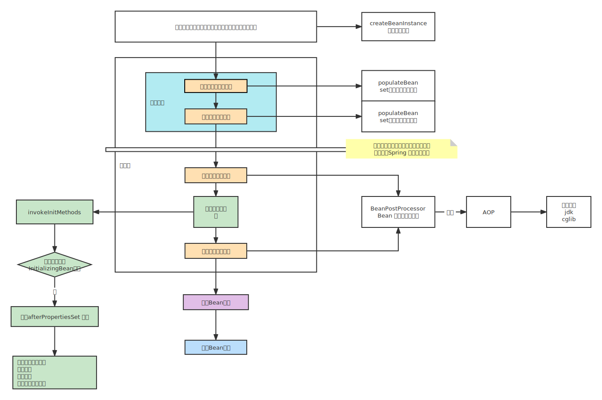

# Spring

## 一、简介

IOC：控制反转

AOP：面向切面编程


## 二、Bean 的生命周期

> 生命周期： 从对象的创建到使用到销毁的过程




### 2.1 Bean 的定义信息

> BeanFactory: Bean 工厂，是 Spring 的一个根接口
>
> PostProcessor：后置处理器
>
> - BeanFactoryPostProcessor： 处理 Bean 的定义信息 BeanDifinition
>
> - BeanPostProcessor：修改 Bean 的信息


> 反射 比 new 更加灵活
>

### 2.2 Bean 的创建


> Aware 接口：
>
> 当容器中创建的 Bean 对象需要进行具体操作时，需要容器的其他对象，可以实现 Aware 接口，来进行操作，用于二次开发。

### 2.3  Bean 的使用

在 Bean 创建时，属性赋值完成后，理论上 Bean 对象已经可以拿来使用了，但是Spring 考虑扩展性，会对 Bean 再做一些处理，完成初始化后即可调用

### 2.4  Bean 的销毁

Bean的销毁是在 Spring 容器关闭时进行销毁，及context.close()方法。

### 2.5、循环依赖

> Spring 中的 Bean 默认情况下是单例的

#### 2.5.1  什么是循环依赖

A 对象内包含了属性 b，B 对象内包含了属性 a。对 A 对象进行实例化后，对 b 属性赋值，这时候会引用 B 对象，判断 容器中是否有 B 对象，有则赋值，无则创建，B同理，这样程序就会报循环依赖的错误。


#### 2.5.2  Spring 解决循环依赖

解决方案：三级缓存、提前暴漏对象

> 当持有了某一个对象的引用之后，能否在后续步骤中给对象进行赋值操作？
>
> 可以，这样就可以解决循环依赖，其解决循环依赖的本质是 Bean 的实例化和初始化可以分开执行


##### 2.5.2.1 三级缓存

DefaultSingletonBeanRegistry 源码

```java

	/**
	* 一级缓存
	* Cache of singleton objects: bean name to bean instance. */
	private final Map<String, Object> singletonObjects = new ConcurrentHashMap<>(256);

	/**
	* 三级缓存
	* 用于保存 BeanName 和 创建 Bean 的工厂之间的联系
	* Cache of singleton factories: bean name to ObjectFactory. */
	private final Map<String, ObjectFactory<?>> singletonFactories = new HashMap<>(16);

	/**
    * 二级缓存
    * 保存 BeanName 和 创建 Bean 实例之间的联系，与 singletonFactories 的不同在于，当单例 Bean 被放到这里后，就可以通过 getBean 方法获取到，可以方便进行循环依赖的检测
    * Cache of early singleton objects: bean name to bean instance. */
	private final Map<String, Object> earlySingletonObjects = new ConcurrentHashMap<>(16);

```

|                | 一级缓存          | 二级缓存          | 三级缓存      |
| -------------- | ----------------- | ----------------- | ------------- |
| 实例化对象类型 | ConcurrentHashMap | ConcurrentHashMap | HashMap       |
| 容量           | 256               | 16                | 16            |
| 泛型           | Object            | Object            | ObjectFactory |

> ObjectFactory：不是对象工厂，是函数式接口
>
> ```java
> @FunctionalInterface
> public interface ObjectFactory<T> {
> 
>    /**
>     * Return an instance (possibly shared or independent)
>     * of the object managed by this factory.
>     * @return the resulting instance
>     * @throws BeansException in case of creation errors
>     */
>    T getObject() throws BeansException;
> 
> }
> ```
>
> jdk1.8后可以将 lambda 表达式作为参数放到方法的参数中，在方法执行的时候，并不会实际调用当前 lambda 表达式，只有在调用 getObject 方法的时候再回去调用 lambda 表达式

##### 2.5.2.2 提前暴露

提前暴露指的是在 Bean 创建完成前 将对象暴露出去，Spring 在解决循环依赖问题时，在实例化后就将未创建完成的 Bean 的 ObjectFactory 放到 三级缓存，这样就把 Bean 提前暴露出去。

#### 2.5.3 spring 源码流程


> 关键方法
>
> 

#### 2.5.4  注意

##### 2.5.4.1 三级缓存结构中 map 分别存储什么类型对象

> 一级缓存：成品对象
>
> 二级缓存：半成品对象
>
> 三级缓存：lambda 表达式

##### 2.5.4.2 三级缓存结构进行对象查找时，顺序是什么？

一级缓存 ==> 二级缓存 ==> 三级缓存

##### 2.5.4.3 如果只有一个 map 结构可以解决循环依赖问题吗？

> 理论上可行，实际没人这么干
>
> 使用两个 map 的意义在于 将成品对象和半成品对象进行区分，半成品对象不能暴露给外部使用，可以设置 标识位进行区分，但是操作比较麻烦，所以直接使用两个 map

##### 2.5.4.4 如果只有两个 map 结构 可以解决循环依赖吗？

> 可以解决，但是前提是 没有使用代理对象的时候，当不使用 AOP 的时候， 两个 map 就可以解决循环依赖问题

##### 2.5.4.5 为什么使用三级缓存可以解决带 AOP 的循环依赖问题

-  一个容器中不能包含同名对象

- 对象创建过程中，扩展阶段 原始对象有可能需要生成代理对象

- 当代理对象出现时，要使用代理对象替换掉原始对象

- 代理对象的创建是在初始化过程的扩展阶段，需要在前置处理过程的时候判断是否需要生成代理对象

- 为什么使用 lambda 表达式（函数式接口）

  > 因为对象什么时候被暴露或被引用无法提前预知，所以只有在被调用的时候才可进行原始对象还是代理对象的判断，使用 lambda 表达式延迟执行的优点，类似于一种回调机制，不暴露的时候不执行，当需要被调用的时候才真正执行 lambda 表达式，来判断返回的是代理对象还是原始对象  

## 三、Spring 执行流程


## 十、基础

### 10.1扩展性

##### 10.1.1 接口和抽象类的区别

> 语法层次：
>
> - 接口多继承、抽象类单继承
> - 接口实现，抽象类继承
> - 接口不能有方法体，抽象类有方法体
> - 接口定义变量只能是静态常量，抽象类则是普通变量
>
> 思想层面：
>
> - 接口：自上向下
>
>   不需要考虑子类实现
>
> - 抽象类：自下向上
>
>   考虑子类共同特点，抽取共同特点生成抽象类
>
> 语义层面
>
> - 接口：主要用于描述特征
> - 抽象类：主要用于描述概念

##### 10.1.2 设计模式

模板方法

### 10.2 反射的基础代码

获取Class 对象

```java
// 根据包名加类名获取 Class 对象
Class clazz = Class.forName("org.apache.catalina.User");
Student student = new Student();
// 根据对象获取 Class 对象
Class clazz = student.getClass();
// 根据类名获取 Class 对象
Class clazz = Student.class;
```

获取构造器

```java
// 获取构造器
Constructor constructor = clazz.getDeclaredConstructor();
```

创建对象

```java
// 创建对象
Object stu = constructor.newInstance();
```

### 10.3 访问 Spring 容器 

- BeanFactory： 访问 Spring 容器的根接口

- ApplicationContext：实现了 BeanFactory

- BeanFactoryPostProcessor：替换 BeanDefinition 中的占位符

   平时业务用不到，但是二次开发可能会用到

  

### 10.4 Spring 中的对象按照使用者分类

- 自定义对象

- 容器对象：  容器创建过程中使用的对象

  > BeanFactory、ApplicationContext....


who：容器调用

when：需要一个统一标识，在统一的地方进行处理

### 10.5 AOP 和 IOC 的关系

AOP 是 IOC 整体流程中的一个扩展点

### 10.6 BeanFactory 和 FactoryBean 的区别

两者都是用来创建对象的，但是当使用 BeanFactory 时必须遵守完整的创建过程，而使用 FactoryBean 只需要调用 getObject 方法就可以返回具体对象，而创建对象的过程由用户自己来控制

- BeanFactory：流水线

> 并不是指根接口，而是 Bean对象创建的整体流程。Bean的生命周期是一个完整的标准化流程，相对比很麻烦。

- FactoryBean：私人定制

> isSingleton：判断是否是单例对象
>
> getObjectType：获取返回对象的类型
>
> getObject：创建对象

### 10.7  观察者模式

> 监听器
>
> 监听事件
>
> 广播器

# 