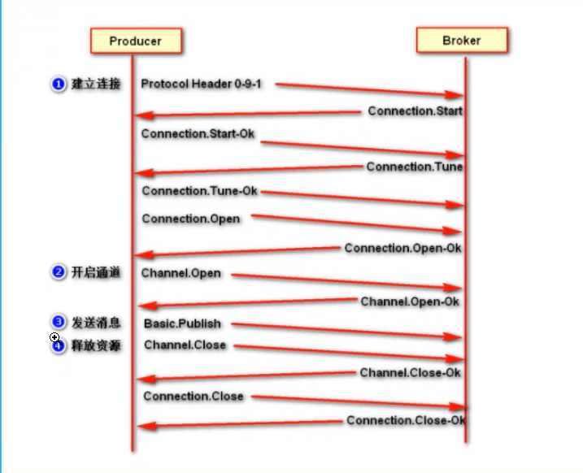
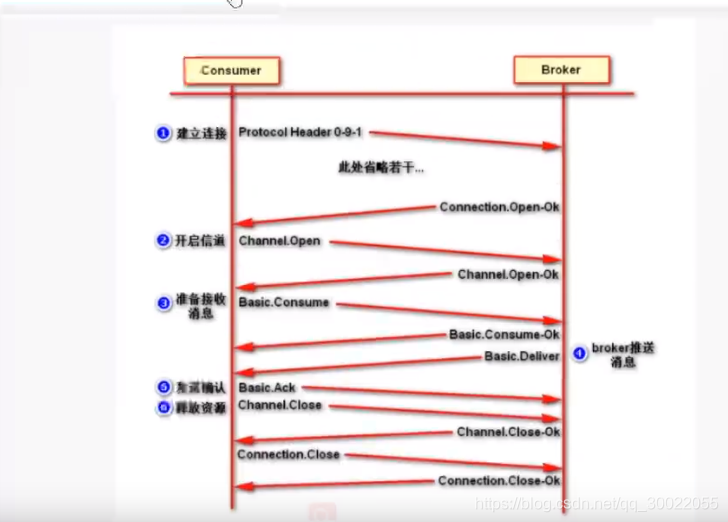
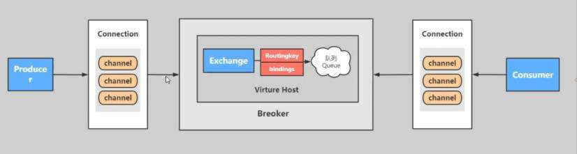

## RabbitMQ

## 一、安装和配置

### 1.1 安装

- 客户端

  官网下载 与PC 匹配的版本下载

- Docker

  在Docker hub 中拉取镜像

  ```dockerfile
  docker pull rabbitmq
  ```


### 1.2 配置

- 新增用户

  ```bash
  rabbitmqctl add_user admin admin
  ```

- 设置用户分配操作权限

  ```bash
  rabbitmqctl set_user_tags admin administrator
  ```

  > 用户级别
  >
  > - administrator 可以控制登录控制台，查看所有信息，可以对 rabbitmq 进行管理
  > - monitoring 监控者 登录控制器，查看所有信息
  > - policymaker 策略制定者 登录控制器，指定策略
  > - managment 普通管理员 登录控制器

- 为用户增加资源权限

  ```bash
  rabbitmqctl.bat set_permission -p / admin ".*" ".*" ".*"
  ```

## 二、角色分类

### 2.1 none

不能访问 management plugin，不能登录web 管理页面

### 2.2 management：查看自己相关节点信息

- 列出自己可以通过AMQP登入的虚拟机
- 查看自己都虚拟机节点 virtual hosts 的 queues, bindings 信息
- 查看和关闭自己的 channels 和 connections
- 查看有关自己的虚拟机节点 virtual hosts 的统计信息，包括其他用户在这个节点 virtual hosts 中的活动信息

### 2.3 Policymaker 决策者

- 包含 management 所有权限
- 查看和创建和删除自己的的 virtual hosts 所属的 policies 和 parameters

### 2.4 Monitoring 监测

- 包含 management 所有权限
- 罗列出所有的 virtual hosts，包含不能登录的 virtual hosts
- 查看其他用户的 connections 和 channels 信息
- 查看系欸按级别的数据，如 clustering 和 memory 使用情况
- 查看所有的 virtual hosts 的全局统计信息

### 2.5 Administrator 超级管理员


## 三、AMQP 协议

高级消息队列协议，是应用层协议的一个开发标准，为面向消息的中间件设计

- 生产者流转过程



- 消费者流转过程

  

## 四、核心概念



1. **Server** :又称Broker,接受客户端的连接,实现AMQP实体服务。安装rabbitmq-server；

2. **Connection** :连接,应用程序与Broker的网络连接TCP/IP/三次握手和四次挥手；

3. **Channel** :网络信道,几乎所有的操作都在Channel中进行, Channel是进行消息读写的通道,客户端可以建立对各Channel,每个Channel代表一个会话任务；

4. **Message** :消息:服务与应用程序之间传送的数据,由Properties和body组成, Properties可是对消息进行修饰,如消息的优先级,延迟等高级特性, Body则就是消息体的内容；

5. **Virtual Host**虚拟地址,用于进行逻辑隔离,最上层的消息路由,一个虚拟主机理由可以有若干个Exhange和Queueu,同一个虚拟主机里面不能有相同名字的Exchange；

6. **Exchange** :交换机,接受消息,根据路由key发送消息到绑定的队列。(==不具备消息存储的能力==)；

   > **direct**：只需要处理 routingKey 默认routing模式
   >
   > **fanout**：只需要队列绑定到交换机，不需要关注 bangdingKey 是什么
   >
   > **topic**：需要对 routingKey 和 bangdingKey 进行模糊匹配
   >
   > > 匹配符号
   > >
   > > #：匹配0个或多个
   > >
   > > *：匹配一个

7. **Bindings** : Exchange和Queue之间的虚拟连接, binding中可以保护多个routing key；

8. **Routing key** :是一个路由规则,虚拟机可以用它来确定如何路由一个特定消息；

9. **Queue** :队列:也成为Message Queue,消息队列,保存消息并将它们转发给消费者。

## 五、代码实现

> 持久化队列：服务器重启后依旧存在
>
> 非持久化队列（临时队列）：服务器重启后消失
>
> 两者消息都会存盘，但是非持久化队列服务重启后消失

### 6.1 全部消费

> Simple、Routing、Topic、Direct

- **生产者**

```java
import com.rabbitmq.client.Channel;
import com.rabbitmq.client.Connection;
import com.rabbitmq.client.ConnectionFactory;
import java.nio.charset.StandardCharsets;

/**
 * Date: 2022-08-11 星期四
 * Time: 10:33
 * Author: Dily_Su
 * Remark: 生产者
 * 所有的中间件技术都是基于 tcp/ip 协议基础上构建的新型协议规范, 只不过 rabbitmq 遵循的是 amqp
 */
public class Producer {

    public static void main(String[] args) {


        // 1、创建连接工程  // ip port
        ConnectionFactory connectionFactory = new ConnectionFactory();
        connectionFactory.setHost("localhost");
        connectionFactory.setPort(5672);
        connectionFactory.setUsername("user");
        connectionFactory.setPassword("password");
        connectionFactory.setVirtualHost("/");

        Connection connection = null;
        Channel channel = null;
        try {
            // 2、创建连接Connection
            connection = connectionFactory.newConnection("生产者");

            // 3、获取连接通道Channel
            channel = connection.createChannel();

            // 4、通过通道创建交换机, 声明队列, 绑定关系, 路由key, 发送消息和接收消息
            String queueName = "queueDemo";

            // 5、准备消息内容
            String msg = "hello fanout";

            // 6、准备交换机
            String exchangeName = "fanout-exchange";
            // 7、指定交换机类型
            String type = "fanout";
            // 8、定义路由key
            String routerKey = "";

            /**
             * 声明交换机,通过可视化工具设置可以省略该过程
             * @params1 交换机名称
             * @params2 交换机类型
             * @params3 是否要持久化，所谓之持久化消息是否存盘，非持久化消息是否存盘？
             */
            channel.exchangeDeclare(exchangeName, type, true);
            /**
             * 创建队列,通过可视化工具设置可以省略该过程
             * @params1 队列名称
             * @params2 是否要持久化，所谓之持久化消息是否存盘，非持久化消息是否存盘？
             * @params3 排他性，是否独占独立
             * @params4 是否自动删除，随着最后一个消息消费后是否把队列自动删除
             * @params5 携带附属参数
             */
            channel.queueDeclare(queueName + 1, false, false, false, null);
            channel.queueDeclare(queueName + 2, false, false, false, null);
            channel.queueDeclare(queueName + 3, false, false, false, null);
            // 队列绑定交换机,通过可视化工具设置可以省略该过程
            channel.queueBind(queueName + 1, exchangeName, routerKey);
            channel.queueBind(queueName + 2, exchangeName, routerKey);
            channel.queueBind(queueName + 3, exchangeName, routerKey);


            // 9、发送消息给队列queue
            /**
             * @params1 交换机
             * @params2 消息队列、路由key
             * @params3 消息的状态控制
             * @params4 消息内容
             */
            for (int i = 0; i < 20; i++) {
                channel.basicPublish(exchangeName, routerKey, null, (msg + "-" + i).getBytes(StandardCharsets.UTF_8));
            }
            System.out.println("消息发送成功");
            System.in.read();

        } catch (Exception e) {
            e.printStackTrace();
        } finally {
            // 10、关闭通道
            if (channel != null && channel.isOpen()) {
                try {
                    channel.close();
                } catch (Exception e) {
                    e.printStackTrace();
                }
            }
            // 11、关闭连接
            if (connection != null && connection.isOpen()) {
                try {
                    connection.close();
                } catch (Exception e) {
                    e.printStackTrace();
                }
            }
        }
    }
}
```

- **消费者**

```java
import com.rabbitmq.client.Channel;
import com.rabbitmq.client.Connection;
import com.rabbitmq.client.ConnectionFactory;
import java.nio.charset.StandardCharsets;

/**
 * Date: 2022-08-11 星期四
 * Time: 10:33
 * Author: Dily_Su
 * Remark: 消费者
 */
public class Customer {

    Runnable runnable = () -> {

        // 1、创建连接工程  // ip port
        ConnectionFactory connectionFactory = new ConnectionFactory();
        connectionFactory.setHost("localhost");
        connectionFactory.setPort(5672);
        connectionFactory.setUsername("user");
        connectionFactory.setPassword("password");
        connectionFactory.setVirtualHost("/");

        Connection connection = null;
        Channel channel = null;
        try {
            // 2、创建连接Connection
            connection = connectionFactory.newConnection("消费者");

            // 3、获取连接通道Channel
            channel = connection.createChannel();

            // 获取 队列名称
            String queueName = Thread.currentThread().getName();

            // 5、通过通道创建交换机, 声明队列, 绑定关系, 路由key, 发送消息和接收消息
            for (int i = 0; i < 20; i++) {
                channel.basicConsume(queueName, true, (s, message) -> System.out.println(queueName+"--接收到的消息是：" + new String(message.getBody(), StandardCharsets.UTF_8)), s -> System.out.println("消息接收失败了"));
            }
            System.in.read();
        } catch (Exception e) {
            e.printStackTrace();
        } finally {
            // 6、关闭通道
            if (channel != null && channel.isOpen()) {
                try {
                    channel.close();
                } catch (Exception e) {
                    e.printStackTrace();
                }
            }
            // 7、关闭连接
            if (connection != null && connection.isOpen()) {
                try {
                    connection.close();
                } catch (Exception e) {
                    e.printStackTrace();
                }
            }        }
    };

    public static void main(String[] args) {
        new Thread(new Customer().runnable,"queueDemo1").start();
        new Thread(new Customer().runnable,"queueDemo2").start();
        new Thread(new Customer().runnable,"queueDemo3").start();

    }


}
```

### 6.3 轮询和公平

> 轮询分配：均匀分配，一消费者一条。多个消费者消费同一个消息队列时，默认是轮询分配
>
> 公平分配：能者多劳，处理快的处理多，必须要使用手动应答

```java
import com.rabbitmq.client.Channel;
import com.rabbitmq.client.Connection;
import com.rabbitmq.client.ConnectionFactory;

import java.nio.charset.StandardCharsets;

/**
 * Date: 2022-08-11 星期四
 * Time: 10:33
 * Author: Dily_Su
 * Remark: 消费者 公平分配
 */
public class Work1 {
    public static void main(String[] args) {


        // 1、创建连接工程  // ip port
        ConnectionFactory connectionFactory = new ConnectionFactory();
        connectionFactory.setHost("localhost");
        connectionFactory.setPort(5672);
        connectionFactory.setUsername("user");
        connectionFactory.setPassword("password");
        connectionFactory.setVirtualHost("/");

        Connection connection = null;
        Channel channel = null;
        try {
            // 2、创建连接Connection
            connection = connectionFactory.newConnection("消费者");

            // 3、获取连接通道Channel
            channel = connection.createChannel();

            // 4、通过通道创建交换机, 声明队列, 绑定关系, 路由key, 发送消息和接收消息
            channel.basicQos(1);  // 设置指标，规定一次取出多少消息
            Channel finalChannel = channel;
            channel.basicConsume(
                    "queueDemo",
                    false, // autoAck  关闭自动应答,进行手动应答，公平分配必须使用手动应答
                    (s, message) -> {
                        System.out.println("Work1-接收到的消息是：" + new String(message.getBody(), StandardCharsets.UTF_8));
                        // 手动应答
                        finalChannel.basicAck(message.getEnvelope().getDeliveryTag(),false);
                        try {
                            // 更改休眠时间，进行测试公平分配
                            Thread.sleep(200);
                        } catch (InterruptedException e) {
                            e.printStackTrace();
                        }
                    },
                    s -> System.out.println("消息接收失败了")
            );
            System.in.read();
        } catch (Exception e) {
            e.printStackTrace();
        } finally {
            // 5、关闭通道
            if (channel != null && channel.isOpen()) {
                try {
                    channel.close();
                } catch (Exception e) {
                    e.printStackTrace();
                }
            }
            // 6、关闭连接
            if (connection != null && connection.isOpen()) {
                try {
                    connection.close();
                } catch (Exception e) {
                    e.printStackTrace();
                }
            }
        }
    }
}
```

## 六、模式

### 6.1 单机模式

一般用于开发环境，单个消息队列服务

### 6.2 普通集群（不高可用）

-  **随机消费其中一个服务中的队列**

  集群内部服务之间相互拉取消息，消耗性能

- **固定消费某个服务的队列**

  服务宕机、单机模式瓶颈

### 6.3 镜像集群（高可用）

- **优点**：

  每次生产者存消息时都进行消息同步，即使某个服务宕机也能保证系统正常运行

- **缺点**：

  性能消耗很大，而且当某个服务需要扩容的时候所有服务都要进行扩容

## 附：

### 1、 Rabbitmq 为什么是基于 channel 去处理而不是 connection ？

因为 connection 是短链接，而且会经历握手，连接断开可能导致消息丢失，而 channel 是长连接，失败重试会保证消息送达。

###   2、可以存在没有交换机的队列吗？

不可能，即使没有指定交换机，也会存在一个默认的交换机

### 3、如何保证消息队列的幂等性？（重复消费）

- 存redis，则不用考虑，redis天然幂等性

- 存数据库

  - 设置唯一键，重复插入会报错，但不会又脏数据
  - 先查后存

- 复杂

  生产者生成一个全局ID 存于 redis，消费后删除，对每条消息消费时查 redis

### 4、如何保证消息的可靠传输？（消息丢失）

#### 4.1 生产者消息丢失

- **事务机制**(使用较少)

  使用 RibbitMq 的事务机制

  > 缺点：大幅度降低吞吐量、该事务是同步的，会阻塞

  ```java
  //  开启事务
  channel.txSelect
  try{
  	// 消息发送
  }catch(Exception e){
      // 事务回滚
      channel.txRollback
  	// 消息重发
  }
  
  // 提交事务
  channel.txCommint
  ```

- **confirm 机制** （常用方式）

  该机制是异步处理的，不会造成消息堵塞

  ​	生产者开启该机制，每次在生产者发送消息时会被分配一个标识ID，如果写入 消息队列成功，则返回ack，反之返回 nack。如果写入失败，则可通过该机制来维护消息标识ID的状态，从而来进行消息超时重发。

  > ACK：消息确认机制
  >
  > ​	RabbitMq 收到生产者的消息后发送给生产者，用于确认消息送达
  >
  > ​	消费者消费消息后发送给 RabbitMq，用于确认消息被消费，RabbitMq删除队列中的消息 

#### 4.2 RabbitMq 导致消息丢失

进行消息持久化

> 1. 创建队列（queue）时设置为持久化到磁盘，该设置是 设置元数据，而不会持久化queue中的数据
> 2. RabbitMq 发送消息时将 deliveryMode 设置为 2，这是将消息进行持久化，当RabbitMq 重启时从磁盘恢复数据
> 3. 但是该机制仍然可能在消息到了消息队列，但是还没持久化到磁盘时宕机丢失内存中的消息，所以就要结合生产者的 confirm 机制来保证消息不丢失

#### 4.3 消费者消息未处理完就宕机导致消息丢失

关闭RabbitMq 的自动 ack，每条消息处理完后再手动 ack 给 RabbitMq 

### 5、如何保证消息的顺序性？

每个生产者一个 queue 一个消费者，通过内存队列来保证消息的顺序性

### 6、消息队列数据积压时怎么处理？

- 修复消费者的问题，将所有消费者服务停掉
- 创建多个新的临时队列queue
- 写一个分发消费者用于将积压的数据消费轮询到临时队列
- 启用多个消费者进行消费临时队列中的消息
- 当积压的数据恢复后将系统恢复到之前的架构

### 7、因为消息在积压过程中过期导致消息丢失怎么办？

写个程序，将丢失的数据查出来，进行批量重导，将丢失的数据重新发送到消息队列

