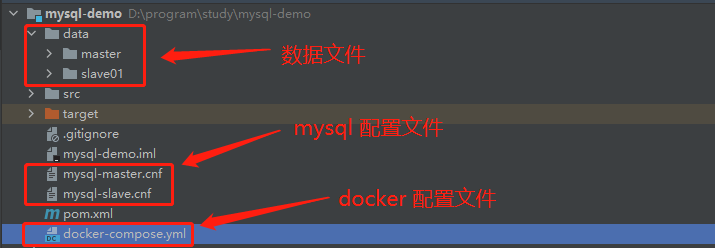
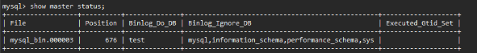

# Mysql分库分表

ShardingSphere 是唯一一个进入Apche 的顶级数据库框架 

目的：解决单机数据库容量上限的问题

优点：成本低，比起使用分布式大数据的数据库而言（ES、HBase、Hive等）

> ShardingJDBC 客户端分库分表
>
> ShardingProxy 服务端分库分表

## 一、核心概念

### 1.1 垂直分片

- **优点**：

  拆分后业务更清晰

  数据维护简单、按业务

- **缺点**：

  如果单表数据量大，读写压力大

  受某种业务来决定或者限制，性能容易受到业务的影响

  部分业务无法关联

> 库的垂直拆分：按业务维度切分扩展数据库连接数，提升数据库IO性能
>
> 表的垂直拆分：将总表字段分割

### 1.2 水平分片

- **优点**

  单库/表 的数据减少，有助于性能的提高

  提高了系统的稳定性和负载能力

  拆分的表结构相同，程序改造较少

- **缺点**

  数据扩容维护难度大

  拆分规则很难抽象出来

  分片事务的一致性问题无法关联

## 二、常用分库策略

- **取模分片**

  优点：数据存放均匀

  缺点：扩容时需要大量数据进行迁移

- **按范围分片**

  优点：扩容不需要迁移数据

  缺点：数据存放不均匀，容易产生数据倾斜

- **按业务场景分片**

  零迁移动态扩容（按范围分片后按取模分片）

## 三、定制分库分表策略

### 3.1 集群搭建

- 主从同步
- 数据一致性补偿

### 3.2 数据分片策略

- **Inline策略**

  单字段分片、不支持范围查询、需要配置分片的字段，只支持精确查询，不需要写算法

- **Standard策略**

  单字段分片、范围查询需要额外配置算法、需要配置分片的字段，支持精确和范围查询，需要自定义算法

- **Complex策略**

  多字段分片、需要配置分片的字段，支持精确和范围查询，需要自定义算法，支持多个分片键

- **Hint强制策略**

  分片字段可通过 HintManger 配置，自由度高，可自由指定 分片键，线程安全，使用 hintManage，需要关闭，需要自定义算法

  不支持多层子查询

  

### 3.3 路由策略

- 分片路由

  - 标准路由

  - 强制路由
  - 笛卡尔路由

- 广播路由

  - 阻断路由
  - 全实例路由

### 3.4 特殊表处理

- 绑定表

  > 用于多表联查消除笛卡儿积的结果

  ```yml
  spring:
    shardingsphere:
      datasource:
        names: m1
  
        m1: # 数据库 m1, 包含连接池、驱动、地址、用户名、密码
          type: com.alibaba.druid.pool.DruidDataSource
          driver-class-name: com.mysql.cj.jdbc.Driver
          url: jdbc:mysql://localhost:3306/sharding_sphere1?serverTimezone=UTC
          username: root
          password: 123456
  
      # 指定数据库分布情况，数据库里面表分布情况
      sharding:
        binding-tables:
          0: user,dict # 进行绑定, user、dict 关联查询时分片字段自动绑定
        tables:
          dict:
            actual-data-nodes: m1.dict_$->{1..2}
            key-generator: # 表中主键生成策略
              column: id           # 分库依赖的列
              type: UUID
            table-strategy: # 分片策略
              inline: # 不支持范围查询
                sharding-column: status
                algorithm-expression: dict_$->{status.toInteger()%2+1}
  
          user:
            actual-data-nodes: m1.user_$->{1..2}
            key-generator: # user 表中主键生成策略
              column: id           # 分库依赖的列
              type: SNOWFLAKE       # 雪花算法
            table-strategy: # 分片策略
              inline: # 不支持范围查询
                sharding-column: status
                algorithm-expression: user_$->{status.toInteger()%2+1}
  ```

- 广播表

  > 向所有分区数据库更新所有操作

  ```yml
  spring:
      shardingsphere:
          datasource:
            names: m1,m2
            
            m1: # 数据库 m1, 包含连接池、驱动、地址、用户名、密码
              type: com.alibaba.druid.pool.DruidDataSource
              driver-class-name: com.mysql.cj.jdbc.Driver
              url: jdbc:mysql://localhost:3306/sharding_sphere1?serverTimezone=UTC
              username: root
              password: 123456
  
            m2: # 数据库 m2, 包含连接池、驱动、地址、用户名、密码
              type: com.alibaba.druid.pool.DruidDataSource
              driver-class-name: com.mysql.cj.jdbc.Driver
              url: jdbc:mysql://localhost:3306/sharding_sphere2?serverTimezone=UTC
              username: root
              password: 123456
  
      sharding:
          broadcast-tables: dict # 自动往所有库中插入相同数据
  ```

- 数据脱敏加密

### 3.5 读写分离规则

> 主从架构
>
> master：写
>
> slave：读

### 3.6 分布式事务处理

- XA事务

- Seata 2PC 事务

## 四、主从集群

### 4.1 原理

- master 更新数据被写到 binlog
- slave 发起连接，连接到 master
- master 创建 binlog dump 线程，并把 binlog 发送到 slave
- slave 启动，创建 I/O 线程，用于读取 master 发送的 binlog，并写到 relay log内
- slave 创建 sql 线程，从 relay log 中读取，从 ExecMasterLog_Pos 位置开始执行读取到的事务，并写入 slave

### 4.2	搭建



#### 4.2.1 master 配置

**master 配置文件 master-cnf**

```yml
[mysqld]
# 设置同一局域网内server-id必须具有唯一性
server-id=1

# 指定复制哪些数据库
binlog-do-db=venus

# 指定不复制哪些数据库
binlog-ignore-db=mysql
binlog-ignore-db=information_schema
binlog-ignore-db=performance_schema
binlog-ignore-db=sys

# 开启二进制日志功能, 并设置日志文件名, 文件名可随意起名
log-bin=mysql-bin

# 设置 binlog 日志格式, 其值可谓 row（默认）、statement、mixed
binlog_format=statement

# 设置每隔多少次事务提交操作才会将这些操作写入二进制日志文件
sync_binlog=1

# 默认使用 “mysql_native_password” 插件认证
default_authentication_plugin=mysql_native_password
```

#### 4.2.2 slave 数据库配置

**slave 配置文件 slave-cnf**

```yml
[mysqld]
# 设置同一局域网内server-id必须具有唯一性
server-id=2

# 开启二进制日志功能, 并设置日志文件名, 文件名可随意起名
# log-bin=mysql-slave-bin

# 指定中继日志
relay-log=slave-relay-bin

# 默认使用 “mysql_native_password” 插件认证
default_authentication_plugin=mysql_native_password	
```

#### 4.2.3 创建master 和 slave 数据库

- #### docker-compose.yml

```yml
version: '3.7'
services:
  master: # 主数据库
    image: mysql:latest
    container_name: mysql-master
    environment:
      - TZ=Asia/Shanghai
      - MYSQL_ROOT_PASSWORD=123456
      - MYSQL_TCP_PORT=3336
    ports:
      - "3336:3336"
    networks:
      - backend
    volumes:
      - ./mysql-master.cnf:/etc/mysql/my.cnf # 配置文件映射
      - ./data/master:/var/lib/mysql # 数据文件映射

  slave01: # 从数据库
    image: mysql:latest
    container_name: mysql-slave01
    environment:
      - TZ=Asia/Shanghai
      - MYSQL_ROOT_PASSWORD=123456
      - MYSQL_TCP_PORT=3337
    ports:
      - "3337:3337"
    networks:
      - backend
    volumes:
      - ./mysql-slave.cnf:/etc/mysql/my.cnf  # 配置文件映射
      - ./data/slave01:/var/lib/mysql # 数据文件映射

networks:
  backend:
    name: master_slave
```

- **启动 docker 镜像**

  ```yml
  # 切换到数据库配置文件目录根下 cmd 执行
  docker compose up -d
  ```

  

- **master 中创建 slave 连接账号**

  ```mysql
  # 可以使用 navicat 连接 master 数据库 执行 sql
  create user 'master'@'%' identified by '123456';
  grant replication slave, replication client on *.* to 'master'@'%';
  ```

- **查看 master 主节点状态并记录状态**

  ```mysql
  # 可以使用 navicat 连接 master 数据库 执行 sql
  show master status;
  ```

  > ps：下图 file 名称要与 .cnf 文件中配置的 log-bin 的名称一致
  >
  > 

  > 1. 如果不一致查看 docker 内镜像启动日志，如果有以下，则代表我们映射的配置文件未生效
  >
  >    ```bash
  >    mysql: [Warning] World-writable config file ‘/etc/mysql/my.cnf‘ is ignored.
  >    ```
  >
  > 2. 在 docker 容器内 执行
  >
  >    ```bash
  >    cd /etc/mysql  # 切换到配置文件目录
  >    ls -l # 查看配置文件的权限信息
  >    ```
  >
  > 3. 将更改配置文件权限
  >
  >    ```bash
  >    chmod 644 my.cnf	
  >    ```
  >
  > 4. 删除 docker 容器的对外映射的 data 信息和镜像，重新部署
  >
  > 

#### 4.2.4 主从同步设置

同步操作都在子节点进行

- **关闭同步**

  ```mysql
  stop slave;
  ```

- **设置同步信息**

  ```mysql
  # 如果 master 和 slave 在不在同一个机器或者不在同一个docker容器内
  change master to 
  master_host="xxx.xxx.xxx.xxx",  # master IP 地址
  master_port=3336,        # master 对外映射端口
  master_user='master',
  master_password='123456'，  # master中为slave设置的用户名
  master_log_file='mysql_bin.000003', # 对照上面master查询到的信息中 file
  master_log_pos=676, # 对照上面master查询到的信息中position
  master_connect_retry=30;
  ```
  
  ```mysql
  # 如果 master 和 slave 在同一个docker容器内
  change master to 
  master_host="localhost",  # master IP 地址
  master_port=3336,        # master 对外映射端口
  master_user='master',  # master中为slave设置的用户名
  master_password='123456',
  master_log_file='mysql_bin.000003', # 对照上面master查询到的信息中 file
  master_log_pos=676, # 对照上面master查询到的信息中position
  master_connect_retry=30;
  ```

- **开启同步**

  ```mysql
  start slave;
  ```

#### 4.2.5 验证同步

- master 数据库中

  根据 master 配置文件中，需要同步的数据库是 test，则创建 test数据库，再创建表 插入数据

- slave 数据库中

  查看 test 数据库以及内部数据

- 结果

   master 中创建的数据库和表以及数据，在 slave 中都能找到，则完成同步

## 五、问题

### 4.1 分布式事务

### 4.2 跨库 join 查询

### 4.3 分布式全局ID

## 六、注意

### 6.1 分库分表

- sql 过于复杂时尽量不要分库
- 单表数据尽量保持小于 500W，大于时就应该考虑分库分表了
- 尽量在业务开始前进行分库分表，不要在业务进行中进行分库分表

