## 1、redis 使用场景？

高并发、高性能

## 2、高并发场景，Redis 的优势和作用

redis 的所有操作都是在内存（主存）中进行，所以天然就有速度快的优势，而且吞吐量也很大，远远超过关系型数据库的吞吐量。而且 redis 在主存中是顺序执行的，所以无需考虑数据一致性。

redis 单机吞吐量 10 W，mysql 单机 吞吐量 8K 。

所以在高并发场景中，可以通过 redis 来减少后端关系型数据库的压力。

## 3、redis 如何提高性能

将查询很耗时间的数据存于 redis，再次访问时直接从缓存获取，则可以提高响应速度

## 4、如何保证 redis 高可用？

生产者开启 ack 机制

redis 开启队列持久化和消息持久化

消费者 实行手动 ack 机制

## 5、缓存雪崩、缓存击穿、缓存穿透

- **缓存穿透**：大量请求在缓存中未命中，大量请求到数据库

  > 解决1：在大量请求缓存未命中时，在第一次请求到数据库时，将 null 存入缓存，避免后续请求到数据库
  >
  > 解决2：加过滤器，过滤器中保持 mysql 中所有ID，如果ID不在，打回，但是内存会占用过大，所有采用布隆算法（用容错率换取空间）：将ID 使用多个哈希算法计算，将多个值存入 bit 数组下标位置，查询时，则先计算多个哈希值，在 bit 数组中进行查询，组合查询ID，都每个哈希值都查询到才算数据存在（多个哈希函数用于降低哈希碰撞）

- **缓存击穿**：高并发热点key过期，导致瞬间大量访问数据库

  > 解决1：热点key永不过期
  >
  > 解决2：使用分布式锁在 redis和MySQL之间，保证每次查询只有一个到数据库

- **缓存雪崩**：redis 宕机导致大量请求到mysql，使mysql挂掉

  > 解决：使用 redis 主从哨兵集群模式

## 6、缓存与数据库双写不一致

## 7、redis 数据丢失

redis 过期策略：定时删除 + 惰性删除

内部淘汰机制：按不同的机制来使内存不足时删除数据、自定义淘汰算法

## 8、如何保证 redis 高并发高可用？

高并发使用主从架构：一主多从，读写分离，主来写，从同步用于查询，

高可用使用主从架构加哨兵：服务宕机进行主备切换

## 9、redis 主从架构如何保证数据不丢失？

定时生成 RDB 快照文件： 数据恢复快，但是当快照大时，可能影响响应速度，最大丢失时间差数据，适合冷备

AOF：记录操作日志， 数据丢失少，数据恢复慢

## 10、redis 集群之分布式切片

优雅的一致性Hash 算法

- 定义哈希环，假设是 2^32

- 分片规则：（ip+id）% 哈希环 = num

  num 的肯定在 [0，2^32-1] 之间，则每条数据在哈希环上都有一个坐标，按照哈希环进行顺时针寻找最近的 redis 数据库进行存储数据

- 数据迁移：

  > 新增：如果在redis 2 和 3 之间新增 redis 4，则只需要将哈希环中redis 2 和 4之间的数据迁移到 redis 4 
  >
  > 删除：如果删除 redis 3，则只需要将 redis3 迁移至 redis 1即可

- 缺点：数据倾斜


## 11、Redis 基本数据类型及其使用场景

- **string**：   key value

  > ```mysql
  > set s 123	# 设置 key=s value=123
  > get s	# 获取 s
  > del s	# 删除 s
  > exist s	# 判断是否存在 s
  > mset a 1 b 2 c 3 # 批量加入 a=1，b=2，c=3
  > mget a b c	# 批量获取 a，b，c
  > expire c 10 # 设置 c 过期时间为 10s
  > setex d 10 4	# 新增 d=4 并设置过期时间为 10s
  > setnx e 5	#	不存在则创建，否则返回0
  > incrby e 5	# e 增加 5
  > incr e 	# e 为整数时每次加一
  > ```

- **list**：key value value ...

  > 消息队列：生产者左侧插入，消费者右侧消费
  >
  > 最新列表：点赞列表、评论列表
  >
  > ```mysql
  > >> rpush list 1 2 3 4 5 6 7	   # 批量存入数据
  > (integer) 7
  > >> rpop list	# 删除最右侧数据并返回
  > "7"
  > >> lpop list	# 删除最左侧数据并返回
  > "1"
  > >> llen list	# 获取列表长度
  > (integer) 5
  > >> lindex list 3 	# 获取指定位置元素 
  > "5"
  > >> lrem list 1 2	# 删除指定数量与值相等的元素 lrem key count value
  > (integer) 1
  > >> lrange list 0 5	# 获取指定区间内的所有元素 lrange key start end
  > 1) "3"
  > 2) "4"
  > 3) "5"
  > 4) "6"
  > >> ltrim list 0 2	# 删除指定区域外所有元素 ltrim	key start end
  > "OK"
  > >> lrange list 0 7
  > 1) "3"
  > 2) "4"
  > 3) "5"
  > ```

- **hash**: key field value

  > 购物车：实现用户ID、商品ID、商品数量
  >
  > 存储对象：对象ID、属性、值
  >
  > ```mysql
  > >> hset order apple 2	# 新增订单 苹果 两个
  > (integer) 1
  > >> hget order apple	# 查看订单中苹果数量
  > "2"
  > >> hdel order apple	# 删除订单中的苹果
  > (integer) 1
  > >> hlen order	# 获取订单中商品数量
  > (integer) 0
  > >> hmset order apple 1 banana 2	# 批量增加商品 苹果一个、香蕉两个
  > "OK"
  > >> hgetall order	# 获取订单中商品列表
  > 1) "apple"
  > 2) "1"
  > 3) "banana"
  > 4) "2"
  > >> hincrby order apple 2	# 订单中 苹果数量加2
  > (integer) 3
  > >> hgetall order
  > 1) "apple"
  > 2) "3"
  > 3) "banana"
  > 4) "2"
  > ```

- **set** ：key value

  > 好友、关注、粉丝、感兴趣的人、首页随机展示、中奖用户
  >
  > 实现 去重、无序集合
  >
  > ```mysql
  > >> sadd fan dily jason		# 粉丝中增加 dily、jason
  > (integer) 2
  > >> smembers fan		# 获取所有粉丝
  > 1) "jason"
  > 2) "dily"
  > >> sismember fan json 	# 判断 json 是不是粉丝
  > (integer) 0
  > >> sismember fan jason	# 判断 jason 是不是粉丝
  > (integer) 1
  > >> scard fan	# 获取 粉丝数量
  > (integer) 2
  > >> spop fan		# 删除粉丝中一个
  > "dily"
  > >> spop fan 	# 删除粉丝中一个
  > "jason"
  > >> sadd fan dily jason	# 批量增加粉丝
  > (integer) 2
  > >> srem fan dily	# 删除指定粉丝
  > (integer) 1
  > ```

- **zset **：key score value

  > 排行榜：score 为关注时间，value为粉丝ID，可对其进行时间排序
  >
  > 学生成绩：score 为分数，value 为 学生ID，可对其进行分数排序获取学生排名
  >
  > ```mysql
  > >> zadd student 100 dily	# 新增学生 dily 分数 100
  > (integer) 1
  > >> zadd student 90 jason	# 新增学生 jason 分数 90
  > (integer) 1
  > >> zadd student 80 mark		# 新增学生 mark 分数 80
  > (integer) 1
  > >> zrange student 0 3 		# 将学生按分数升序排列
  > 1) "mark"
  > 2) "jason"
  > 3) "dily"
  > >> zrevrange student 0 3	# 将学生按分数降序排列
  > 1) "dily"
  > 2) "jason"
  > 3) "mark"
  > >> zcard student			# 获取学生数量
  > (integer) 3
  > >> zrank student dily		# 获取学生中 dily 的升序排名
  > (integer) 2
  > >> zrevrank student dily	# 获取学生中 dily 的降序排名
  > (integer) 0
  > >> zrangebyscore student 60 90	# 获取分数区间内的学生
  > 1) "mark"
  > 2) "jason"
  > >> zrem student mark		# 删除学生 mark
  > (integer) 1
  > >> zscore student jason		# 获取学生 jason 的分数
  > "90"
  > ```
